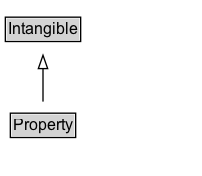

# Property

A property, used to indicate attributes and relationships of some Thing; equivalent to rdf:Property.

## Diagram

=== "SVG (interactive)"

    <!-- Generated by graphviz version 14.1.3 (20260303.0454)
     -->
    <!-- Pages: 1 -->
    <svg width="151pt" height="132pt"
     viewBox="0.00 0.00 151.00 132.00" xmlns="http://www.w3.org/2000/svg" xmlns:xlink="http://www.w3.org/1999/xlink">
    <g id="graph0" class="graph" transform="scale(1 1) rotate(0) translate(4 128)">
    <polygon fill="white" stroke="none" points="-4,4 -4,-128 147.25,-128 147.25,4 -4,4"/>
    <g id="clust3" class="cluster">
    <title>cluster_associated</title>
    </g>
    <!-- Intangible -->
    <g id="node1" class="node">
    <title>Intangible</title>
    <g id="a_node1"><a xlink:href="../Intangible" xlink:title="&lt;TABLE&gt;">
    <polygon fill="lightgray" stroke="none" points="1,-97.88 1,-114.12 55.5,-114.12 55.5,-97.88 1,-97.88"/>
    <text xml:space="preserve" text-anchor="start" x="2" y="-101.88" font-family="Arial" font-size="12.00">Intangible</text>
    <polygon fill="none" stroke="black" points="0,-96.88 0,-115.12 56.5,-115.12 56.5,-96.88 0,-96.88"/>
    </a>
    </g>
    </g>
    <!-- Property -->
    <g id="node2" class="node">
    <title>Property</title>
    <g id="a_node2"><a xlink:href="../Property" xlink:title="&lt;TABLE&gt;">
    <polygon fill="lightgray" stroke="none" points="4.75,-25.88 4.75,-42.12 51.75,-42.12 51.75,-25.88 4.75,-25.88"/>
    <text xml:space="preserve" text-anchor="start" x="5.75" y="-29.88" font-family="Arial" font-size="12.00">Property</text>
    <polygon fill="none" stroke="black" points="3.75,-24.88 3.75,-43.12 52.75,-43.12 52.75,-24.88 3.75,-24.88"/>
    </a>
    </g>
    </g>
    <!-- Property&#45;&gt;Intangible -->
    <g id="edge1" class="edge">
    <title>Property&#45;&gt;Intangible</title>
    <path fill="none" stroke="black" d="M28.25,-51.79C28.25,-59.25 28.25,-68.24 28.25,-76.69"/>
    <polygon fill="none" stroke="black" points="24.75,-76.54 28.25,-86.54 31.75,-76.54 24.75,-76.54"/>
    </g>
    <!-- Invis -->
    </g>
    </svg>

=== "PNG"

    

## Formalization for Property

| Property | Constraint |
|----------|------------|
| subClassOf | [Intangible](Intangible.md) |

