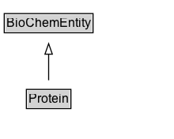

# Protein

Protein is here used in its widest possible definition, as classes of amino acid based molecules. Amyloid-beta Protein in human (UniProt P05067), eukaryota (e.g. an OrthoDB group) or even a single molecule that one can point to are all of type :Protein. A protein can thus be a subclass of another protein, e.g. :Protein as a UniProt record can have multiple isoforms inside it which would also be :Protein. They can be imagined, synthetic, hypothetical or naturally occurring.

## Diagram

=== "SVG (interactive)"

    <!-- Generated by graphviz version 14.1.3 (20260303.0454)
     -->
    <!-- Pages: 1 -->
    <svg width="165pt" height="132pt"
     viewBox="0.00 0.00 165.00 132.00" xmlns="http://www.w3.org/2000/svg" xmlns:xlink="http://www.w3.org/1999/xlink">
    <g id="graph0" class="graph" transform="scale(1 1) rotate(0) translate(4 128)">
    <polygon fill="white" stroke="none" points="-4,4 -4,-128 161.12,-128 161.12,4 -4,4"/>
    <g id="clust3" class="cluster">
    <title>cluster_associated</title>
    </g>
    <!-- BioChemEntity -->
    <g id="node1" class="node">
    <title>BioChemEntity</title>
    <g id="a_node1"><a xlink:href="../BioChemEntity" xlink:title="&lt;TABLE&gt;">
    <polygon fill="lightgray" stroke="none" points="1,-97.88 1,-114.12 83.25,-114.12 83.25,-97.88 1,-97.88"/>
    <text xml:space="preserve" text-anchor="start" x="2" y="-101.88" font-family="Arial" font-size="12.00">BioChemEntity</text>
    <polygon fill="none" stroke="black" points="0,-96.88 0,-115.12 84.25,-115.12 84.25,-96.88 0,-96.88"/>
    </a>
    </g>
    </g>
    <!-- Protein -->
    <g id="node2" class="node">
    <title>Protein</title>
    <g id="a_node2"><a xlink:href="../Protein" xlink:title="&lt;TABLE&gt;">
    <polygon fill="lightgray" stroke="none" points="22,-25.88 22,-42.12 62.25,-42.12 62.25,-25.88 22,-25.88"/>
    <text xml:space="preserve" text-anchor="start" x="23" y="-29.88" font-family="Arial" font-size="12.00">Protein</text>
    <polygon fill="none" stroke="black" points="21,-24.88 21,-43.12 63.25,-43.12 63.25,-24.88 21,-24.88"/>
    </a>
    </g>
    </g>
    <!-- Protein&#45;&gt;BioChemEntity -->
    <g id="edge1" class="edge">
    <title>Protein&#45;&gt;BioChemEntity</title>
    <path fill="none" stroke="black" d="M42.12,-51.79C42.12,-59.25 42.12,-68.24 42.12,-76.69"/>
    <polygon fill="none" stroke="black" points="38.63,-76.54 42.13,-86.54 45.63,-76.54 38.63,-76.54"/>
    </g>
    <!-- Invis -->
    </g>
    </svg>

=== "PNG"

    

## Formalization for Protein

| Property | Constraint |
|----------|------------|
| subClassOf | [BioChemEntity](BioChemEntity.md) |

