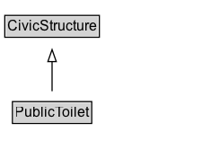

# PublicToilet

A public toilet is a room or small building containing one or more toilets (and possibly also urinals) which is available for use by the general public, or by customers or employees of certain businesses.

## Diagram

=== "SVG (interactive)"

    <!-- Generated by graphviz version 14.1.3 (20260303.0454)
     -->
    <!-- Pages: 1 -->
    <svg width="169pt" height="132pt"
     viewBox="0.00 0.00 169.00 132.00" xmlns="http://www.w3.org/2000/svg" xmlns:xlink="http://www.w3.org/1999/xlink">
    <g id="graph0" class="graph" transform="scale(1 1) rotate(0) translate(4 128)">
    <polygon fill="white" stroke="none" points="-4,4 -4,-128 164.5,-128 164.5,4 -4,4"/>
    <g id="clust3" class="cluster">
    <title>cluster_associated</title>
    </g>
    <!-- CivicStructure -->
    <g id="node1" class="node">
    <title>CivicStructure</title>
    <g id="a_node1"><a xlink:href="../CivicStructure" xlink:title="&lt;TABLE&gt;">
    <polygon fill="lightgray" stroke="none" points="1,-97.88 1,-114.12 78,-114.12 78,-97.88 1,-97.88"/>
    <text xml:space="preserve" text-anchor="start" x="2" y="-101.88" font-family="Arial" font-size="12.00">CivicStructure</text>
    <polygon fill="none" stroke="black" points="0,-96.88 0,-115.12 79,-115.12 79,-96.88 0,-96.88"/>
    </a>
    </g>
    </g>
    <!-- PublicToilet -->
    <g id="node2" class="node">
    <title>PublicToilet</title>
    <g id="a_node2"><a xlink:href="../PublicToilet" xlink:title="&lt;TABLE&gt;">
    <polygon fill="lightgray" stroke="none" points="7.38,-25.88 7.38,-42.12 71.62,-42.12 71.62,-25.88 7.38,-25.88"/>
    <text xml:space="preserve" text-anchor="start" x="8.38" y="-29.88" font-family="Arial" font-size="12.00">PublicToilet</text>
    <polygon fill="none" stroke="black" points="6.38,-24.88 6.38,-43.12 72.62,-43.12 72.62,-24.88 6.38,-24.88"/>
    </a>
    </g>
    </g>
    <!-- PublicToilet&#45;&gt;CivicStructure -->
    <g id="edge1" class="edge">
    <title>PublicToilet&#45;&gt;CivicStructure</title>
    <path fill="none" stroke="black" d="M39.5,-51.79C39.5,-59.25 39.5,-68.24 39.5,-76.69"/>
    <polygon fill="none" stroke="black" points="36,-76.54 39.5,-86.54 43,-76.54 36,-76.54"/>
    </g>
    <!-- Invis -->
    </g>
    </svg>

=== "PNG"

    

## Formalization for PublicToilet

| Property | Constraint |
|----------|------------|
| subClassOf | [CivicStructure](CivicStructure.md) |

