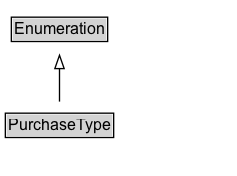

# PurchaseType

Enumerates a purchase type for an item.

## Diagram

=== "SVG (interactive)"

    <!-- Generated by graphviz version 14.1.3 (20260303.0454)
     -->
    <!-- Pages: 1 -->
    <svg width="178pt" height="132pt"
     viewBox="0.00 0.00 178.00 132.00" xmlns="http://www.w3.org/2000/svg" xmlns:xlink="http://www.w3.org/1999/xlink">
    <g id="graph0" class="graph" transform="scale(1 1) rotate(0) translate(4 128)">
    <polygon fill="white" stroke="none" points="-4,4 -4,-128 173.62,-128 173.62,4 -4,4"/>
    <g id="clust3" class="cluster">
    <title>cluster_associated</title>
    </g>
    <!-- Enumeration -->
    <g id="node1" class="node">
    <title>Enumeration</title>
    <g id="a_node1"><a xlink:href="../Enumeration" xlink:title="&lt;TABLE&gt;">
    <polygon fill="lightgray" stroke="none" points="5.5,-97.88 5.5,-114.12 75.75,-114.12 75.75,-97.88 5.5,-97.88"/>
    <text xml:space="preserve" text-anchor="start" x="6.5" y="-101.88" font-family="Arial" font-size="12.00">Enumeration</text>
    <polygon fill="none" stroke="black" points="4.5,-96.88 4.5,-115.12 76.75,-115.12 76.75,-96.88 4.5,-96.88"/>
    </a>
    </g>
    </g>
    <!-- PurchaseType -->
    <g id="node2" class="node">
    <title>PurchaseType</title>
    <g id="a_node2"><a xlink:href="../PurchaseType" xlink:title="&lt;TABLE&gt;">
    <polygon fill="lightgray" stroke="none" points="1,-25.88 1,-42.12 80.25,-42.12 80.25,-25.88 1,-25.88"/>
    <text xml:space="preserve" text-anchor="start" x="2" y="-29.88" font-family="Arial" font-size="12.00">PurchaseType</text>
    <polygon fill="none" stroke="black" points="0,-24.88 0,-43.12 81.25,-43.12 81.25,-24.88 0,-24.88"/>
    </a>
    </g>
    </g>
    <!-- PurchaseType&#45;&gt;Enumeration -->
    <g id="edge1" class="edge">
    <title>PurchaseType&#45;&gt;Enumeration</title>
    <path fill="none" stroke="black" d="M40.62,-51.79C40.62,-59.25 40.62,-68.24 40.62,-76.69"/>
    <polygon fill="none" stroke="black" points="37.13,-76.54 40.63,-86.54 44.13,-76.54 37.13,-76.54"/>
    </g>
    <!-- Invis -->
    </g>
    </svg>

=== "PNG"

    

## Formalization for PurchaseType

| Property | Constraint |
|----------|------------|
| subClassOf | [Enumeration](Enumeration.md) |

