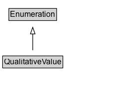

# QualitativeValue

A predefined value for a product characteristic, e.g. the power cord plug type 'US' or the garment sizes 'S', 'M', 'L', and 'XL'.

## Diagram

=== "SVG (interactive)"

    <!-- Generated by graphviz version 14.1.3 (20260303.0454)
     -->
    <!-- Pages: 1 -->
    <svg width="188pt" height="132pt"
     viewBox="0.00 0.00 188.00 132.00" xmlns="http://www.w3.org/2000/svg" xmlns:xlink="http://www.w3.org/1999/xlink">
    <g id="graph0" class="graph" transform="scale(1 1) rotate(0) translate(4 128)">
    <polygon fill="white" stroke="none" points="-4,4 -4,-128 183.5,-128 183.5,4 -4,4"/>
    <g id="clust3" class="cluster">
    <title>cluster_associated</title>
    </g>
    <!-- Enumeration -->
    <g id="node1" class="node">
    <title>Enumeration</title>
    <g id="a_node1"><a xlink:href="../Enumeration" xlink:title="&lt;TABLE&gt;">
    <polygon fill="lightgray" stroke="none" points="10.38,-97.88 10.38,-114.12 80.62,-114.12 80.62,-97.88 10.38,-97.88"/>
    <text xml:space="preserve" text-anchor="start" x="11.38" y="-101.88" font-family="Arial" font-size="12.00">Enumeration</text>
    <polygon fill="none" stroke="black" points="9.38,-96.88 9.38,-115.12 81.62,-115.12 81.62,-96.88 9.38,-96.88"/>
    </a>
    </g>
    </g>
    <!-- QualitativeValue -->
    <g id="node2" class="node">
    <title>QualitativeValue</title>
    <g id="a_node2"><a xlink:href="../QualitativeValue" xlink:title="&lt;TABLE&gt;">
    <polygon fill="lightgray" stroke="none" points="1,-25.88 1,-42.12 90,-42.12 90,-25.88 1,-25.88"/>
    <text xml:space="preserve" text-anchor="start" x="2" y="-29.88" font-family="Arial" font-size="12.00">QualitativeValue</text>
    <polygon fill="none" stroke="black" points="0,-24.88 0,-43.12 91,-43.12 91,-24.88 0,-24.88"/>
    </a>
    </g>
    </g>
    <!-- QualitativeValue&#45;&gt;Enumeration -->
    <g id="edge1" class="edge">
    <title>QualitativeValue&#45;&gt;Enumeration</title>
    <path fill="none" stroke="black" d="M45.5,-51.79C45.5,-59.25 45.5,-68.24 45.5,-76.69"/>
    <polygon fill="none" stroke="black" points="42,-76.54 45.5,-86.54 49,-76.54 42,-76.54"/>
    </g>
    <!-- Invis -->
    </g>
    </svg>

=== "PNG"

    

## Specializations of QualitativeValue

| Class | Description |
|-------|-------------|
| [Bed Type](BedType.md) | A type of bed. This is used for indicating the bed or beds available in an accommodation. |
| [Drive Wheel Configuration Value](DriveWheelConfigurationValue.md) | A value indicating which roadwheels will receive torque. |
| [Size Specification](SizeSpecification.md) | Size related properties of a product, typically a size code ([[name]]) and optionally a [[sizeSystem]], [[sizeGroup]], and product measurements ([[hasMeasurement]]). In addition, the intended audience can be defined through [[suggestedAge]], [[suggestedGender]], and suggested body measurements ([[suggestedMeasurement]]). |
| [Steering Position Value](SteeringPositionValue.md) | A value indicating a steering position. |

## Formalization for QualitativeValue

| Property | Constraint |
|----------|------------|
| subClassOf | [Enumeration](Enumeration.md) |

