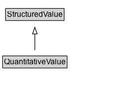

# QuantitativeValue

 A point value or interval for product characteristics and other purposes.

## Diagram

=== "SVG (interactive)"

    <!-- Generated by graphviz version 14.1.3 (20260303.0454)
     -->
    <!-- Pages: 1 -->
    <svg width="194pt" height="132pt"
     viewBox="0.00 0.00 194.00 132.00" xmlns="http://www.w3.org/2000/svg" xmlns:xlink="http://www.w3.org/1999/xlink">
    <g id="graph0" class="graph" transform="scale(1 1) rotate(0) translate(4 128)">
    <polygon fill="white" stroke="none" points="-4,4 -4,-128 189.88,-128 189.88,4 -4,4"/>
    <g id="clust3" class="cluster">
    <title>cluster_associated</title>
    </g>
    <!-- StructuredValue -->
    <g id="node1" class="node">
    <title>StructuredValue</title>
    <g id="a_node1"><a xlink:href="../StructuredValue" xlink:title="&lt;TABLE&gt;">
    <polygon fill="lightgray" stroke="none" points="5.5,-97.88 5.5,-114.12 92.25,-114.12 92.25,-97.88 5.5,-97.88"/>
    <text xml:space="preserve" text-anchor="start" x="6.5" y="-101.88" font-family="Arial" font-size="12.00">StructuredValue</text>
    <polygon fill="none" stroke="black" points="4.5,-96.88 4.5,-115.12 93.25,-115.12 93.25,-96.88 4.5,-96.88"/>
    </a>
    </g>
    </g>
    <!-- QuantitativeValue -->
    <g id="node2" class="node">
    <title>QuantitativeValue</title>
    <g id="a_node2"><a xlink:href="../QuantitativeValue" xlink:title="&lt;TABLE&gt;">
    <polygon fill="lightgray" stroke="none" points="1,-25.88 1,-42.12 96.75,-42.12 96.75,-25.88 1,-25.88"/>
    <text xml:space="preserve" text-anchor="start" x="2" y="-29.88" font-family="Arial" font-size="12.00">QuantitativeValue</text>
    <polygon fill="none" stroke="black" points="0,-24.88 0,-43.12 97.75,-43.12 97.75,-24.88 0,-24.88"/>
    </a>
    </g>
    </g>
    <!-- QuantitativeValue&#45;&gt;StructuredValue -->
    <g id="edge1" class="edge">
    <title>QuantitativeValue&#45;&gt;StructuredValue</title>
    <path fill="none" stroke="black" d="M48.88,-51.79C48.88,-59.25 48.88,-68.24 48.88,-76.69"/>
    <polygon fill="none" stroke="black" points="45.38,-76.54 48.88,-86.54 52.38,-76.54 45.38,-76.54"/>
    </g>
    <!-- Invis -->
    </g>
    </svg>

=== "PNG"

    

## Specializations of QuantitativeValue

| Class | Description |
|-------|-------------|
| [Observation](Observation.md) | Instances of the class [[Observation]] are used to specify observations about an entity at a particular time. The principal properties of an [[Observation]] are [[observationAbout]], [[measuredProperty]], [[statType]], [[value] and [[observationDate]]  and [[measuredProperty]]. Some but not all Observations represent a [[QuantitativeValue]]. Quantitative observations can be about a [[StatisticalVariable]], which is an abstract specification about which we can make observations that are grounded at a particular location and time.

Observations can also encode a subset of simple RDF-like statements (its observationAbout, a StatisticalVariable, defining the measuredPoperty; its observationAbout property indicating the entity the statement is about, and [[value]] )

In the context of a quantitative knowledge graph, typical properties could include [[measuredProperty]], [[observationAbout]], [[observationDate]], [[value]], [[unitCode]], [[unitText]], [[measurementMethod]].
     |

## Formalization for QuantitativeValue

| Property | Constraint |
|----------|------------|
| subClassOf | [StructuredValue](StructuredValue.md) |

