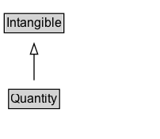

# Quantity

Quantities such as distance, time, mass, weight, etc. Particular instances of say Mass are entities like '3 kg' or '4 milligrams'.

## Diagram

=== "SVG (interactive)"

    <!-- Generated by graphviz version 14.1.3 (20260303.0454)
     -->
    <!-- Pages: 1 -->
    <svg width="151pt" height="132pt"
     viewBox="0.00 0.00 151.00 132.00" xmlns="http://www.w3.org/2000/svg" xmlns:xlink="http://www.w3.org/1999/xlink">
    <g id="graph0" class="graph" transform="scale(1 1) rotate(0) translate(4 128)">
    <polygon fill="white" stroke="none" points="-4,4 -4,-128 147.25,-128 147.25,4 -4,4"/>
    <g id="clust3" class="cluster">
    <title>cluster_associated</title>
    </g>
    <!-- Intangible -->
    <g id="node1" class="node">
    <title>Intangible</title>
    <g id="a_node1"><a xlink:href="../Intangible" xlink:title="&lt;TABLE&gt;">
    <polygon fill="lightgray" stroke="none" points="1,-97.88 1,-114.12 55.5,-114.12 55.5,-97.88 1,-97.88"/>
    <text xml:space="preserve" text-anchor="start" x="2" y="-101.88" font-family="Arial" font-size="12.00">Intangible</text>
    <polygon fill="none" stroke="black" points="0,-96.88 0,-115.12 56.5,-115.12 56.5,-96.88 0,-96.88"/>
    </a>
    </g>
    </g>
    <!-- Quantity -->
    <g id="node2" class="node">
    <title>Quantity</title>
    <g id="a_node2"><a xlink:href="../Quantity" xlink:title="&lt;TABLE&gt;">
    <polygon fill="lightgray" stroke="none" points="5.12,-25.88 5.12,-42.12 51.38,-42.12 51.38,-25.88 5.12,-25.88"/>
    <text xml:space="preserve" text-anchor="start" x="6.12" y="-29.88" font-family="Arial" font-size="12.00">Quantity</text>
    <polygon fill="none" stroke="black" points="4.12,-24.88 4.12,-43.12 52.38,-43.12 52.38,-24.88 4.12,-24.88"/>
    </a>
    </g>
    </g>
    <!-- Quantity&#45;&gt;Intangible -->
    <g id="edge1" class="edge">
    <title>Quantity&#45;&gt;Intangible</title>
    <path fill="none" stroke="black" d="M28.25,-51.79C28.25,-59.25 28.25,-68.24 28.25,-76.69"/>
    <polygon fill="none" stroke="black" points="24.75,-76.54 28.25,-86.54 31.75,-76.54 24.75,-76.54"/>
    </g>
    <!-- Invis -->
    </g>
    </svg>

=== "PNG"

    

## Specializations of Quantity

| Class | Description |
|-------|-------------|
| [Distance](Distance.md) | Properties that take Distances as values are of the form '&lt;Number&gt; &lt;Length unit of measure&gt;'. E.g., '7 ft'. |
| [Duration](Duration.md) | Quantity: Duration (use [ISO 8601 duration format](http://en.wikipedia.org/wiki/ISO_8601)). |
| [Energy](Energy.md) | Properties that take Energy as values are of the form '&lt;Number&gt; &lt;Energy unit of measure&gt;'. |
| [Mass](Mass.md) | Properties that take Mass as values are of the form '&lt;Number&gt; &lt;Mass unit of measure&gt;'. E.g., '7 kg'. |

## Formalization for Quantity

| Property | Constraint |
|----------|------------|
| subClassOf | [Intangible](Intangible.md) |

