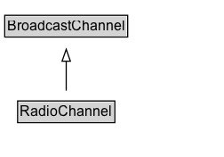

# RadioChannel

A unique instance of a radio BroadcastService on a CableOrSatelliteService lineup.

## Diagram

=== "SVG (interactive)"

    <!-- Generated by graphviz version 14.1.3 (20260303.0454)
     -->
    <!-- Pages: 1 -->
    <svg width="189pt" height="132pt"
     viewBox="0.00 0.00 189.00 132.00" xmlns="http://www.w3.org/2000/svg" xmlns:xlink="http://www.w3.org/1999/xlink">
    <g id="graph0" class="graph" transform="scale(1 1) rotate(0) translate(4 128)">
    <polygon fill="white" stroke="none" points="-4,4 -4,-128 184.88,-128 184.88,4 -4,4"/>
    <g id="clust3" class="cluster">
    <title>cluster_associated</title>
    </g>
    <!-- BroadcastChannel -->
    <g id="node1" class="node">
    <title>BroadcastChannel</title>
    <g id="a_node1"><a xlink:href="../BroadcastChannel" xlink:title="&lt;TABLE&gt;">
    <polygon fill="lightgray" stroke="none" points="1,-97.88 1,-114.12 102.75,-114.12 102.75,-97.88 1,-97.88"/>
    <text xml:space="preserve" text-anchor="start" x="2" y="-101.88" font-family="Arial" font-size="12.00">BroadcastChannel</text>
    <polygon fill="none" stroke="black" points="0,-96.88 0,-115.12 103.75,-115.12 103.75,-96.88 0,-96.88"/>
    </a>
    </g>
    </g>
    <!-- RadioChannel -->
    <g id="node2" class="node">
    <title>RadioChannel</title>
    <g id="a_node2"><a xlink:href="../RadioChannel" xlink:title="&lt;TABLE&gt;">
    <polygon fill="lightgray" stroke="none" points="11.88,-25.88 11.88,-42.12 91.88,-42.12 91.88,-25.88 11.88,-25.88"/>
    <text xml:space="preserve" text-anchor="start" x="12.88" y="-29.88" font-family="Arial" font-size="12.00">RadioChannel</text>
    <polygon fill="none" stroke="black" points="10.88,-24.88 10.88,-43.12 92.88,-43.12 92.88,-24.88 10.88,-24.88"/>
    </a>
    </g>
    </g>
    <!-- RadioChannel&#45;&gt;BroadcastChannel -->
    <g id="edge1" class="edge">
    <title>RadioChannel&#45;&gt;BroadcastChannel</title>
    <path fill="none" stroke="black" d="M51.88,-51.79C51.88,-59.25 51.88,-68.24 51.88,-76.69"/>
    <polygon fill="none" stroke="black" points="48.38,-76.54 51.88,-86.54 55.38,-76.54 48.38,-76.54"/>
    </g>
    <!-- Invis -->
    </g>
    </svg>

=== "PNG"

    

## Specializations of RadioChannel

| Class | Description |
|-------|-------------|
| [Am Radio Channel](AMRadioChannel.md) | A radio channel that uses AM. |
| [Fm Radio Channel](FMRadioChannel.md) | A radio channel that uses FM. |

## Formalization for RadioChannel

| Property | Constraint |
|----------|------------|
| subClassOf | [BroadcastChannel](BroadcastChannel.md) |

