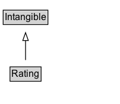

# Rating

A rating is an evaluation on a numeric scale, such as 1 to 5 stars.

## Diagram

=== "SVG (interactive)"

    <!-- Generated by graphviz version 14.1.3 (20260303.0454)
     -->
    <!-- Pages: 1 -->
    <svg width="151pt" height="132pt"
     viewBox="0.00 0.00 151.00 132.00" xmlns="http://www.w3.org/2000/svg" xmlns:xlink="http://www.w3.org/1999/xlink">
    <g id="graph0" class="graph" transform="scale(1 1) rotate(0) translate(4 128)">
    <polygon fill="white" stroke="none" points="-4,4 -4,-128 147.25,-128 147.25,4 -4,4"/>
    <g id="clust3" class="cluster">
    <title>cluster_associated</title>
    </g>
    <!-- Intangible -->
    <g id="node1" class="node">
    <title>Intangible</title>
    <g id="a_node1"><a xlink:href="../Intangible" xlink:title="&lt;TABLE&gt;">
    <polygon fill="lightgray" stroke="none" points="1,-97.88 1,-114.12 55.5,-114.12 55.5,-97.88 1,-97.88"/>
    <text xml:space="preserve" text-anchor="start" x="2" y="-101.88" font-family="Arial" font-size="12.00">Intangible</text>
    <polygon fill="none" stroke="black" points="0,-96.88 0,-115.12 56.5,-115.12 56.5,-96.88 0,-96.88"/>
    </a>
    </g>
    </g>
    <!-- Rating -->
    <g id="node2" class="node">
    <title>Rating</title>
    <g id="a_node2"><a xlink:href="../Rating" xlink:title="&lt;TABLE&gt;">
    <polygon fill="lightgray" stroke="none" points="9.62,-25.88 9.62,-42.12 46.88,-42.12 46.88,-25.88 9.62,-25.88"/>
    <text xml:space="preserve" text-anchor="start" x="10.62" y="-29.88" font-family="Arial" font-size="12.00">Rating</text>
    <polygon fill="none" stroke="black" points="8.62,-24.88 8.62,-43.12 47.88,-43.12 47.88,-24.88 8.62,-24.88"/>
    </a>
    </g>
    </g>
    <!-- Rating&#45;&gt;Intangible -->
    <g id="edge1" class="edge">
    <title>Rating&#45;&gt;Intangible</title>
    <path fill="none" stroke="black" d="M28.25,-51.79C28.25,-59.25 28.25,-68.24 28.25,-76.69"/>
    <polygon fill="none" stroke="black" points="24.75,-76.54 28.25,-86.54 31.75,-76.54 24.75,-76.54"/>
    </g>
    <!-- Invis -->
    </g>
    </svg>

=== "PNG"

    

## Specializations of Rating

| Class | Description |
|-------|-------------|
| [Aggregate Rating](AggregateRating.md) | The average rating based on multiple ratings or reviews. |
| [Employer Aggregate Rating](EmployerAggregateRating.md) | An aggregate rating of an Organization related to its role as an employer. |
| [Endorsement Rating](EndorsementRating.md) | An EndorsementRating is a rating that expresses some level of endorsement, for example inclusion in a "critic's pick" blog, a
"Like" or "+1" on a social network. It can be considered the [[result]] of an [[EndorseAction]] in which the [[object]] of the action is rated positively by
some [[agent]]. As is common elsewhere in schema.org, it is sometimes more useful to describe the results of such an action without explicitly describing the [[Action]].

An [[EndorsementRating]] may be part of a numeric scale or organized system, but this is not required: having an explicit type for indicating a positive,
endorsement rating is particularly useful in the absence of numeric scales as it helps consumers understand that the rating is broadly positive.
 |

## Formalization for Rating

| Property | Constraint |
|----------|------------|
| subClassOf | [Intangible](Intangible.md) |

