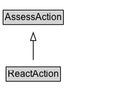

# ReactAction

The act of responding instinctively and emotionally to an object, expressing a sentiment.

## Diagram

=== "SVG (interactive)"

    <!-- Generated by graphviz version 14.1.3 (20260303.0454)
     -->
    <!-- Pages: 1 -->
    <svg width="169pt" height="132pt"
     viewBox="0.00 0.00 169.00 132.00" xmlns="http://www.w3.org/2000/svg" xmlns:xlink="http://www.w3.org/1999/xlink">
    <g id="graph0" class="graph" transform="scale(1 1) rotate(0) translate(4 128)">
    <polygon fill="white" stroke="none" points="-4,4 -4,-128 165.38,-128 165.38,4 -4,4"/>
    <g id="clust3" class="cluster">
    <title>cluster_associated</title>
    </g>
    <!-- AssessAction -->
    <g id="node1" class="node">
    <title>AssessAction</title>
    <g id="a_node1"><a xlink:href="../AssessAction" xlink:title="&lt;TABLE&gt;">
    <polygon fill="lightgray" stroke="none" points="1,-97.88 1,-114.12 75.75,-114.12 75.75,-97.88 1,-97.88"/>
    <text xml:space="preserve" text-anchor="start" x="2" y="-101.88" font-family="Arial" font-size="12.00">AssessAction</text>
    <polygon fill="none" stroke="black" points="0,-96.88 0,-115.12 76.75,-115.12 76.75,-96.88 0,-96.88"/>
    </a>
    </g>
    </g>
    <!-- ReactAction -->
    <g id="node2" class="node">
    <title>ReactAction</title>
    <g id="a_node2"><a xlink:href="../ReactAction" xlink:title="&lt;TABLE&gt;">
    <polygon fill="lightgray" stroke="none" points="4.75,-25.88 4.75,-42.12 72,-42.12 72,-25.88 4.75,-25.88"/>
    <text xml:space="preserve" text-anchor="start" x="5.75" y="-29.88" font-family="Arial" font-size="12.00">ReactAction</text>
    <polygon fill="none" stroke="black" points="3.75,-24.88 3.75,-43.12 73,-43.12 73,-24.88 3.75,-24.88"/>
    </a>
    </g>
    </g>
    <!-- ReactAction&#45;&gt;AssessAction -->
    <g id="edge1" class="edge">
    <title>ReactAction&#45;&gt;AssessAction</title>
    <path fill="none" stroke="black" d="M38.38,-51.79C38.38,-59.25 38.38,-68.24 38.38,-76.69"/>
    <polygon fill="none" stroke="black" points="34.88,-76.54 38.38,-86.54 41.88,-76.54 34.88,-76.54"/>
    </g>
    <!-- Invis -->
    </g>
    </svg>

=== "PNG"

    

## Specializations of ReactAction

| Class | Description |
|-------|-------------|
| [Agree Action](AgreeAction.md) | The act of expressing a consistency of opinion with the object. An agent agrees to/about an object (a proposition, topic or theme) with participants. |
| [Disagree Action](DisagreeAction.md) | The act of expressing a difference of opinion with the object. An agent disagrees to/about an object (a proposition, topic or theme) with participants. |
| [Dislike Action](DislikeAction.md) | The act of expressing a negative sentiment about the object. An agent dislikes an object (a proposition, topic or theme) with participants. |
| [Endorse Action](EndorseAction.md) | An agent approves/certifies/likes/supports/sanctions an object. |
| [Like Action](LikeAction.md) | The act of expressing a positive sentiment about the object. An agent likes an object (a proposition, topic or theme) with participants. |
| [Want Action](WantAction.md) | The act of expressing a desire about the object. An agent wants an object. |

## Formalization for ReactAction

| Property | Constraint |
|----------|------------|
| subClassOf | [AssessAction](AssessAction.md) |

