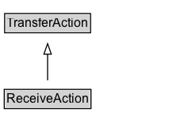

# ReceiveAction

The act of physically/electronically taking delivery of an object that has been transferred from an origin to a destination. Reciprocal of SendAction.\n\nRelated actions:\n\n* [[SendAction]]: The reciprocal of ReceiveAction.\n* [[TakeAction]]: Unlike TakeAction, ReceiveAction does not imply that the ownership has been transferred (e.g. I can receive a package, but it does not mean the package is now mine).

## Diagram

=== "SVG (interactive)"

    <!-- Generated by graphviz version 14.1.3 (20260303.0454)
     -->
    <!-- Pages: 1 -->
    <svg width="178pt" height="132pt"
     viewBox="0.00 0.00 178.00 132.00" xmlns="http://www.w3.org/2000/svg" xmlns:xlink="http://www.w3.org/1999/xlink">
    <g id="graph0" class="graph" transform="scale(1 1) rotate(0) translate(4 128)">
    <polygon fill="white" stroke="none" points="-4,4 -4,-128 174,-128 174,4 -4,4"/>
    <g id="clust3" class="cluster">
    <title>cluster_associated</title>
    </g>
    <!-- TransferAction -->
    <g id="node1" class="node">
    <title>TransferAction</title>
    <g id="a_node1"><a xlink:href="../TransferAction" xlink:title="&lt;TABLE&gt;">
    <polygon fill="lightgray" stroke="none" points="1.38,-97.88 1.38,-114.12 80.62,-114.12 80.62,-97.88 1.38,-97.88"/>
    <text xml:space="preserve" text-anchor="start" x="2.38" y="-101.88" font-family="Arial" font-size="12.00">TransferAction</text>
    <polygon fill="none" stroke="black" points="0.38,-96.88 0.38,-115.12 81.62,-115.12 81.62,-96.88 0.38,-96.88"/>
    </a>
    </g>
    </g>
    <!-- ReceiveAction -->
    <g id="node2" class="node">
    <title>ReceiveAction</title>
    <g id="a_node2"><a xlink:href="../ReceiveAction" xlink:title="&lt;TABLE&gt;">
    <polygon fill="lightgray" stroke="none" points="1,-25.88 1,-42.12 81,-42.12 81,-25.88 1,-25.88"/>
    <text xml:space="preserve" text-anchor="start" x="2" y="-29.88" font-family="Arial" font-size="12.00">ReceiveAction</text>
    <polygon fill="none" stroke="black" points="0,-24.88 0,-43.12 82,-43.12 82,-24.88 0,-24.88"/>
    </a>
    </g>
    </g>
    <!-- ReceiveAction&#45;&gt;TransferAction -->
    <g id="edge1" class="edge">
    <title>ReceiveAction&#45;&gt;TransferAction</title>
    <path fill="none" stroke="black" d="M41,-51.79C41,-59.25 41,-68.24 41,-76.69"/>
    <polygon fill="none" stroke="black" points="37.5,-76.54 41,-86.54 44.5,-76.54 37.5,-76.54"/>
    </g>
    <!-- Invis -->
    </g>
    </svg>

=== "PNG"

    

## Formalization for ReceiveAction

| Property | Constraint |
|----------|------------|
| subClassOf | [TransferAction](TransferAction.md) |

