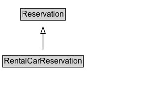

# RentalCarReservation

A reservation for a rental car.\n\nNote: This type is for information about actual reservations, e.g. in confirmation emails or HTML pages with individual confirmations of reservations.

## Diagram

=== "SVG (interactive)"

    <!-- Generated by graphviz version 14.1.3 (20260303.0454)
     -->
    <!-- Pages: 1 -->
    <svg width="220pt" height="132pt"
     viewBox="0.00 0.00 220.00 132.00" xmlns="http://www.w3.org/2000/svg" xmlns:xlink="http://www.w3.org/1999/xlink">
    <g id="graph0" class="graph" transform="scale(1 1) rotate(0) translate(4 128)">
    <polygon fill="white" stroke="none" points="-4,4 -4,-128 215.62,-128 215.62,4 -4,4"/>
    <g id="clust3" class="cluster">
    <title>cluster_associated</title>
    </g>
    <!-- Reservation -->
    <g id="node1" class="node">
    <title>Reservation</title>
    <g id="a_node1"><a xlink:href="../Reservation" xlink:title="&lt;TABLE&gt;">
    <polygon fill="lightgray" stroke="none" points="28.38,-97.88 28.38,-114.12 94.88,-114.12 94.88,-97.88 28.38,-97.88"/>
    <text xml:space="preserve" text-anchor="start" x="29.38" y="-101.88" font-family="Arial" font-size="12.00">Reservation</text>
    <polygon fill="none" stroke="black" points="27.38,-96.88 27.38,-115.12 95.88,-115.12 95.88,-96.88 27.38,-96.88"/>
    </a>
    </g>
    </g>
    <!-- RentalCarReservation -->
    <g id="node2" class="node">
    <title>RentalCarReservation</title>
    <g id="a_node2"><a xlink:href="../RentalCarReservation" xlink:title="&lt;TABLE&gt;">
    <polygon fill="lightgray" stroke="none" points="1,-25.88 1,-42.12 122.25,-42.12 122.25,-25.88 1,-25.88"/>
    <text xml:space="preserve" text-anchor="start" x="2" y="-29.88" font-family="Arial" font-size="12.00">RentalCarReservation</text>
    <polygon fill="none" stroke="black" points="0,-24.88 0,-43.12 123.25,-43.12 123.25,-24.88 0,-24.88"/>
    </a>
    </g>
    </g>
    <!-- RentalCarReservation&#45;&gt;Reservation -->
    <g id="edge1" class="edge">
    <title>RentalCarReservation&#45;&gt;Reservation</title>
    <path fill="none" stroke="black" d="M61.62,-51.79C61.62,-59.25 61.62,-68.24 61.62,-76.69"/>
    <polygon fill="none" stroke="black" points="58.13,-76.54 61.63,-86.54 65.13,-76.54 58.13,-76.54"/>
    </g>
    <!-- Invis -->
    </g>
    </svg>

=== "PNG"

    

## Formalization for RentalCarReservation

| Property | Constraint |
|----------|------------|
| subClassOf | [Reservation](Reservation.md) |

