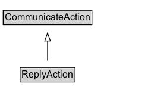

# ReplyAction

The act of responding to a question/message asked/sent by the object. Related to [[AskAction]].\n\nRelated actions:\n\n* [[AskAction]]: Appears generally as an origin of a ReplyAction.

## Diagram

=== "SVG (interactive)"

    <!-- Generated by graphviz version 14.1.3 (20260303.0454)
     -->
    <!-- Pages: 1 -->
    <svg width="187pt" height="132pt"
     viewBox="0.00 0.00 187.00 132.00" xmlns="http://www.w3.org/2000/svg" xmlns:xlink="http://www.w3.org/1999/xlink">
    <g id="graph0" class="graph" transform="scale(1 1) rotate(0) translate(4 128)">
    <polygon fill="white" stroke="none" points="-4,4 -4,-128 183,-128 183,4 -4,4"/>
    <g id="clust3" class="cluster">
    <title>cluster_associated</title>
    </g>
    <!-- CommunicateAction -->
    <g id="node1" class="node">
    <title>CommunicateAction</title>
    <g id="a_node1"><a xlink:href="../CommunicateAction" xlink:title="&lt;TABLE&gt;">
    <polygon fill="lightgray" stroke="none" points="1,-97.88 1,-114.12 111,-114.12 111,-97.88 1,-97.88"/>
    <text xml:space="preserve" text-anchor="start" x="2" y="-101.88" font-family="Arial" font-size="12.00">CommunicateAction</text>
    <polygon fill="none" stroke="black" points="0,-96.88 0,-115.12 112,-115.12 112,-96.88 0,-96.88"/>
    </a>
    </g>
    </g>
    <!-- ReplyAction -->
    <g id="node2" class="node">
    <title>ReplyAction</title>
    <g id="a_node2"><a xlink:href="../ReplyAction" xlink:title="&lt;TABLE&gt;">
    <polygon fill="lightgray" stroke="none" points="22.38,-25.88 22.38,-42.12 89.62,-42.12 89.62,-25.88 22.38,-25.88"/>
    <text xml:space="preserve" text-anchor="start" x="23.38" y="-29.88" font-family="Arial" font-size="12.00">ReplyAction</text>
    <polygon fill="none" stroke="black" points="21.38,-24.88 21.38,-43.12 90.62,-43.12 90.62,-24.88 21.38,-24.88"/>
    </a>
    </g>
    </g>
    <!-- ReplyAction&#45;&gt;CommunicateAction -->
    <g id="edge1" class="edge">
    <title>ReplyAction&#45;&gt;CommunicateAction</title>
    <path fill="none" stroke="black" d="M56,-51.79C56,-59.25 56,-68.24 56,-76.69"/>
    <polygon fill="none" stroke="black" points="52.5,-76.54 56,-86.54 59.5,-76.54 52.5,-76.54"/>
    </g>
    <!-- Invis -->
    </g>
    </svg>

=== "PNG"

    

## Formalization for ReplyAction

| Property | Constraint |
|----------|------------|
| subClassOf | [CommunicateAction](CommunicateAction.md) |

