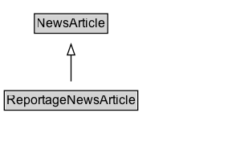

# ReportageNewsArticle

The [[ReportageNewsArticle]] type is a subtype of [[NewsArticle]] representing
 news articles which are the result of journalistic news reporting conventions.

In practice many news publishers produce a wide variety of article types, many of which might be considered a [[NewsArticle]] but not a [[ReportageNewsArticle]]. For example, opinion pieces, reviews, analysis, sponsored or satirical articles, or articles that combine several of these elements.

The [[ReportageNewsArticle]] type is based on a stricter ideal for "news" as a work of journalism, with articles based on factual information either observed or verified by the author, or reported and verified from knowledgeable sources.  This often includes perspectives from multiple viewpoints on a particular issue (distinguishing news reports from public relations or propaganda).  News reports in the [[ReportageNewsArticle]] sense de-emphasize the opinion of the author, with commentary and value judgements typically expressed elsewhere.

A [[ReportageNewsArticle]] which goes deeper into analysis can also be marked with an additional type of [[AnalysisNewsArticle]].

## Diagram

=== "SVG (interactive)"

    <!-- Generated by graphviz version 14.1.3 (20260303.0454)
     -->
    <!-- Pages: 1 -->
    <svg width="220pt" height="132pt"
     viewBox="0.00 0.00 220.00 132.00" xmlns="http://www.w3.org/2000/svg" xmlns:xlink="http://www.w3.org/1999/xlink">
    <g id="graph0" class="graph" transform="scale(1 1) rotate(0) translate(4 128)">
    <polygon fill="white" stroke="none" points="-4,4 -4,-128 216.38,-128 216.38,4 -4,4"/>
    <g id="clust3" class="cluster">
    <title>cluster_associated</title>
    </g>
    <!-- NewsArticle -->
    <g id="node1" class="node">
    <title>NewsArticle</title>
    <g id="a_node1"><a xlink:href="../NewsArticle" xlink:title="&lt;TABLE&gt;">
    <polygon fill="lightgray" stroke="none" points="29.12,-97.88 29.12,-114.12 95.62,-114.12 95.62,-97.88 29.12,-97.88"/>
    <text xml:space="preserve" text-anchor="start" x="30.12" y="-101.88" font-family="Arial" font-size="12.00">NewsArticle</text>
    <polygon fill="none" stroke="black" points="28.12,-96.88 28.12,-115.12 96.62,-115.12 96.62,-96.88 28.12,-96.88"/>
    </a>
    </g>
    </g>
    <!-- ReportageNewsArticle -->
    <g id="node2" class="node">
    <title>ReportageNewsArticle</title>
    <g id="a_node2"><a xlink:href="../ReportageNewsArticle" xlink:title="&lt;TABLE&gt;">
    <polygon fill="lightgray" stroke="none" points="1,-25.88 1,-42.12 123.75,-42.12 123.75,-25.88 1,-25.88"/>
    <text xml:space="preserve" text-anchor="start" x="2" y="-29.88" font-family="Arial" font-size="12.00">ReportageNewsArticle</text>
    <polygon fill="none" stroke="black" points="0,-24.88 0,-43.12 124.75,-43.12 124.75,-24.88 0,-24.88"/>
    </a>
    </g>
    </g>
    <!-- ReportageNewsArticle&#45;&gt;NewsArticle -->
    <g id="edge1" class="edge">
    <title>ReportageNewsArticle&#45;&gt;NewsArticle</title>
    <path fill="none" stroke="black" d="M62.38,-51.79C62.38,-59.25 62.38,-68.24 62.38,-76.69"/>
    <polygon fill="none" stroke="black" points="58.88,-76.54 62.38,-86.54 65.88,-76.54 58.88,-76.54"/>
    </g>
    <!-- Invis -->
    </g>
    </svg>

=== "PNG"

    

## Formalization for ReportageNewsArticle

| Property | Constraint |
|----------|------------|
| subClassOf | [NewsArticle](NewsArticle.md) |

