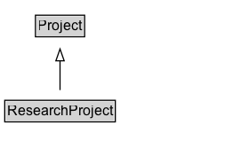

# ResearchProject

A Research project.

## Diagram

=== "SVG (interactive)"

    <!-- Generated by graphviz version 14.1.3 (20260303.0454)
     -->
    <!-- Pages: 1 -->
    <svg width="190pt" height="132pt"
     viewBox="0.00 0.00 190.00 132.00" xmlns="http://www.w3.org/2000/svg" xmlns:xlink="http://www.w3.org/1999/xlink">
    <g id="graph0" class="graph" transform="scale(1 1) rotate(0) translate(4 128)">
    <polygon fill="white" stroke="none" points="-4,4 -4,-128 185.62,-128 185.62,4 -4,4"/>
    <g id="clust3" class="cluster">
    <title>cluster_associated</title>
    </g>
    <!-- Project -->
    <g id="node1" class="node">
    <title>Project</title>
    <g id="a_node1"><a xlink:href="../Project" xlink:title="&lt;TABLE&gt;">
    <polygon fill="lightgray" stroke="none" points="26.88,-97.88 26.88,-114.12 66.38,-114.12 66.38,-97.88 26.88,-97.88"/>
    <text xml:space="preserve" text-anchor="start" x="27.88" y="-101.88" font-family="Arial" font-size="12.00">Project</text>
    <polygon fill="none" stroke="black" points="25.88,-96.88 25.88,-115.12 67.38,-115.12 67.38,-96.88 25.88,-96.88"/>
    </a>
    </g>
    </g>
    <!-- ResearchProject -->
    <g id="node2" class="node">
    <title>ResearchProject</title>
    <g id="a_node2"><a xlink:href="../ResearchProject" xlink:title="&lt;TABLE&gt;">
    <polygon fill="lightgray" stroke="none" points="1,-25.88 1,-42.12 92.25,-42.12 92.25,-25.88 1,-25.88"/>
    <text xml:space="preserve" text-anchor="start" x="2" y="-29.88" font-family="Arial" font-size="12.00">ResearchProject</text>
    <polygon fill="none" stroke="black" points="0,-24.88 0,-43.12 93.25,-43.12 93.25,-24.88 0,-24.88"/>
    </a>
    </g>
    </g>
    <!-- ResearchProject&#45;&gt;Project -->
    <g id="edge1" class="edge">
    <title>ResearchProject&#45;&gt;Project</title>
    <path fill="none" stroke="black" d="M46.62,-51.79C46.62,-59.25 46.62,-68.24 46.62,-76.69"/>
    <polygon fill="none" stroke="black" points="43.13,-76.54 46.63,-86.54 50.13,-76.54 43.13,-76.54"/>
    </g>
    <!-- Invis -->
    </g>
    </svg>

=== "PNG"

    

## Formalization for ResearchProject

| Property | Constraint |
|----------|------------|
| subClassOf | [Project](Project.md) |

