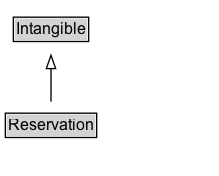

# Reservation

Describes a reservation for travel, dining or an event. Some reservations require tickets. \n\nNote: This type is for information about actual reservations, e.g. in confirmation emails or HTML pages with individual confirmations of reservations. For offers of tickets, restaurant reservations, flights, or rental cars, use [[Offer]].

## Diagram

=== "SVG (interactive)"

    <!-- Generated by graphviz version 14.1.3 (20260303.0454)
     -->
    <!-- Pages: 1 -->
    <svg width="164pt" height="132pt"
     viewBox="0.00 0.00 164.00 132.00" xmlns="http://www.w3.org/2000/svg" xmlns:xlink="http://www.w3.org/1999/xlink">
    <g id="graph0" class="graph" transform="scale(1 1) rotate(0) translate(4 128)">
    <polygon fill="white" stroke="none" points="-4,4 -4,-128 160.25,-128 160.25,4 -4,4"/>
    <g id="clust3" class="cluster">
    <title>cluster_associated</title>
    </g>
    <!-- Intangible -->
    <g id="node1" class="node">
    <title>Intangible</title>
    <g id="a_node1"><a xlink:href="../Intangible" xlink:title="&lt;TABLE&gt;">
    <polygon fill="lightgray" stroke="none" points="7,-97.88 7,-114.12 61.5,-114.12 61.5,-97.88 7,-97.88"/>
    <text xml:space="preserve" text-anchor="start" x="8" y="-101.88" font-family="Arial" font-size="12.00">Intangible</text>
    <polygon fill="none" stroke="black" points="6,-96.88 6,-115.12 62.5,-115.12 62.5,-96.88 6,-96.88"/>
    </a>
    </g>
    </g>
    <!-- Reservation -->
    <g id="node2" class="node">
    <title>Reservation</title>
    <g id="a_node2"><a xlink:href="../Reservation" xlink:title="&lt;TABLE&gt;">
    <polygon fill="lightgray" stroke="none" points="1,-25.88 1,-42.12 67.5,-42.12 67.5,-25.88 1,-25.88"/>
    <text xml:space="preserve" text-anchor="start" x="2" y="-29.88" font-family="Arial" font-size="12.00">Reservation</text>
    <polygon fill="none" stroke="black" points="0,-24.88 0,-43.12 68.5,-43.12 68.5,-24.88 0,-24.88"/>
    </a>
    </g>
    </g>
    <!-- Reservation&#45;&gt;Intangible -->
    <g id="edge1" class="edge">
    <title>Reservation&#45;&gt;Intangible</title>
    <path fill="none" stroke="black" d="M34.25,-51.79C34.25,-59.25 34.25,-68.24 34.25,-76.69"/>
    <polygon fill="none" stroke="black" points="30.75,-76.54 34.25,-86.54 37.75,-76.54 30.75,-76.54"/>
    </g>
    <!-- Invis -->
    </g>
    </svg>

=== "PNG"

    

## Specializations of Reservation

| Class | Description |
|-------|-------------|
| [Boat Reservation](BoatReservation.md) | A reservation for boat travel.

Note: This type is for information about actual reservations, e.g. in confirmation emails or HTML pages with individual confirmations of reservations. For offers of tickets, use [[Offer]]. |
| [Bus Reservation](BusReservation.md) | A reservation for bus travel. \n\nNote: This type is for information about actual reservations, e.g. in confirmation emails or HTML pages with individual confirmations of reservations. For offers of tickets, use [[Offer]]. |
| [Event Reservation](EventReservation.md) | A reservation for an event like a concert, sporting event, or lecture.\n\nNote: This type is for information about actual reservations, e.g. in confirmation emails or HTML pages with individual confirmations of reservations. For offers of tickets, use [[Offer]]. |
| [Flight Reservation](FlightReservation.md) | A reservation for air travel.\n\nNote: This type is for information about actual reservations, e.g. in confirmation emails or HTML pages with individual confirmations of reservations. For offers of tickets, use [[Offer]]. |
| [Food Establishment Reservation](FoodEstablishmentReservation.md) | A reservation to dine at a food-related business.\n\nNote: This type is for information about actual reservations, e.g. in confirmation emails or HTML pages with individual confirmations of reservations. |
| [Lodging Reservation](LodgingReservation.md) | A reservation for lodging at a hotel, motel, inn, etc.\n\nNote: This type is for information about actual reservations, e.g. in confirmation emails or HTML pages with individual confirmations of reservations. |
| [Rental Car Reservation](RentalCarReservation.md) | A reservation for a rental car.\n\nNote: This type is for information about actual reservations, e.g. in confirmation emails or HTML pages with individual confirmations of reservations. |
| [Reservation Package](ReservationPackage.md) | A group of multiple reservations with common values for all sub-reservations. |
| [Taxi Reservation](TaxiReservation.md) | A reservation for a taxi.\n\nNote: This type is for information about actual reservations, e.g. in confirmation emails or HTML pages with individual confirmations of reservations. For offers of tickets, use [[Offer]]. |
| [Train Reservation](TrainReservation.md) | A reservation for train travel.\n\nNote: This type is for information about actual reservations, e.g. in confirmation emails or HTML pages with individual confirmations of reservations. For offers of tickets, use [[Offer]]. |

## Formalization for Reservation

| Property | Constraint |
|----------|------------|
| subClassOf | [Intangible](Intangible.md) |

