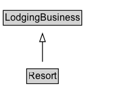

# Resort

A resort is a place used for relaxation or recreation, attracting visitors for holidays or vacations. Resorts are places, towns or sometimes commercial establishments operated by a single company (source: Wikipedia, the free encyclopedia, see <a href="http://en.wikipedia.org/wiki/Resort">http://en.wikipedia.org/wiki/Resort</a>).
  
See also the <a href="/docs/hotels.html">dedicated document on the use of schema.org for marking up hotels and other forms of accommodations</a>.
    

## Diagram

=== "SVG (interactive)"

    <!-- Generated by graphviz version 14.1.3 (20260303.0454)
     -->
    <!-- Pages: 1 -->
    <svg width="172pt" height="132pt"
     viewBox="0.00 0.00 172.00 132.00" xmlns="http://www.w3.org/2000/svg" xmlns:xlink="http://www.w3.org/1999/xlink">
    <g id="graph0" class="graph" transform="scale(1 1) rotate(0) translate(4 128)">
    <polygon fill="white" stroke="none" points="-4,4 -4,-128 167.5,-128 167.5,4 -4,4"/>
    <g id="clust3" class="cluster">
    <title>cluster_associated</title>
    </g>
    <!-- LodgingBusiness -->
    <g id="node1" class="node">
    <title>LodgingBusiness</title>
    <g id="a_node1"><a xlink:href="../LodgingBusiness" xlink:title="&lt;TABLE&gt;">
    <polygon fill="lightgray" stroke="none" points="1,-97.88 1,-114.12 96,-114.12 96,-97.88 1,-97.88"/>
    <text xml:space="preserve" text-anchor="start" x="2" y="-101.88" font-family="Arial" font-size="12.00">LodgingBusiness</text>
    <polygon fill="none" stroke="black" points="0,-96.88 0,-115.12 97,-115.12 97,-96.88 0,-96.88"/>
    </a>
    </g>
    </g>
    <!-- Resort -->
    <g id="node2" class="node">
    <title>Resort</title>
    <g id="a_node2"><a xlink:href="../Resort" xlink:title="&lt;TABLE&gt;">
    <polygon fill="lightgray" stroke="none" points="29.88,-25.88 29.88,-42.12 67.12,-42.12 67.12,-25.88 29.88,-25.88"/>
    <text xml:space="preserve" text-anchor="start" x="30.88" y="-29.88" font-family="Arial" font-size="12.00">Resort</text>
    <polygon fill="none" stroke="black" points="28.88,-24.88 28.88,-43.12 68.12,-43.12 68.12,-24.88 28.88,-24.88"/>
    </a>
    </g>
    </g>
    <!-- Resort&#45;&gt;LodgingBusiness -->
    <g id="edge1" class="edge">
    <title>Resort&#45;&gt;LodgingBusiness</title>
    <path fill="none" stroke="black" d="M48.5,-51.79C48.5,-59.25 48.5,-68.24 48.5,-76.69"/>
    <polygon fill="none" stroke="black" points="45,-76.54 48.5,-86.54 52,-76.54 45,-76.54"/>
    </g>
    <!-- Invis -->
    </g>
    </svg>

=== "PNG"

    

## Specializations of Resort

| Class | Description |
|-------|-------------|
| [Ski Resort](SkiResort.md) | A ski resort. |

## Formalization for Resort

| Property | Constraint |
|----------|------------|
| subClassOf | [LodgingBusiness](LodgingBusiness.md) |

