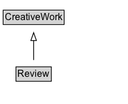

# Review

A review of an item - for example, of a restaurant, movie, or store.

## Diagram

=== "SVG (interactive)"

    <!-- Generated by graphviz version 14.1.3 (20260303.0454)
     -->
    <!-- Pages: 1 -->
    <svg width="161pt" height="132pt"
     viewBox="0.00 0.00 161.00 132.00" xmlns="http://www.w3.org/2000/svg" xmlns:xlink="http://www.w3.org/1999/xlink">
    <g id="graph0" class="graph" transform="scale(1 1) rotate(0) translate(4 128)">
    <polygon fill="white" stroke="none" points="-4,4 -4,-128 157.38,-128 157.38,4 -4,4"/>
    <g id="clust3" class="cluster">
    <title>cluster_associated</title>
    </g>
    <!-- CreativeWork -->
    <g id="node1" class="node">
    <title>CreativeWork</title>
    <g id="a_node1"><a xlink:href="../CreativeWork" xlink:title="&lt;TABLE&gt;">
    <polygon fill="lightgray" stroke="none" points="1,-97.88 1,-114.12 75.75,-114.12 75.75,-97.88 1,-97.88"/>
    <text xml:space="preserve" text-anchor="start" x="2" y="-101.88" font-family="Arial" font-size="12.00">CreativeWork</text>
    <polygon fill="none" stroke="black" points="0,-96.88 0,-115.12 76.75,-115.12 76.75,-96.88 0,-96.88"/>
    </a>
    </g>
    </g>
    <!-- Review -->
    <g id="node2" class="node">
    <title>Review</title>
    <g id="a_node2"><a xlink:href="../Review" xlink:title="&lt;TABLE&gt;">
    <polygon fill="lightgray" stroke="none" points="17.12,-25.88 17.12,-42.12 59.62,-42.12 59.62,-25.88 17.12,-25.88"/>
    <text xml:space="preserve" text-anchor="start" x="18.12" y="-29.88" font-family="Arial" font-size="12.00">Review</text>
    <polygon fill="none" stroke="black" points="16.12,-24.88 16.12,-43.12 60.62,-43.12 60.62,-24.88 16.12,-24.88"/>
    </a>
    </g>
    </g>
    <!-- Review&#45;&gt;CreativeWork -->
    <g id="edge1" class="edge">
    <title>Review&#45;&gt;CreativeWork</title>
    <path fill="none" stroke="black" d="M38.38,-51.79C38.38,-59.25 38.38,-68.24 38.38,-76.69"/>
    <polygon fill="none" stroke="black" points="34.88,-76.54 38.38,-86.54 41.88,-76.54 34.88,-76.54"/>
    </g>
    <!-- Invis -->
    </g>
    </svg>

=== "PNG"

    

## Specializations of Review

| Class | Description |
|-------|-------------|
| [Claim Review](ClaimReview.md) | A fact-checking review of claims made (or reported) in some creative work (referenced via itemReviewed). |
| [Critic Review](CriticReview.md) | A [[CriticReview]] is a more specialized form of Review written or published by a source that is recognized for its reviewing activities. These can include online columns, travel and food guides, TV and radio shows, blogs and other independent Web sites. [[CriticReview]]s are typically more in-depth and professionally written. For simpler, casually written user/visitor/viewer/customer reviews, it is more appropriate to use the [[UserReview]] type. Review aggregator sites such as Metacritic already separate out the site's user reviews from selected critic reviews that originate from third-party sources. |
| [Employer Review](EmployerReview.md) | An [[EmployerReview]] is a review of an [[Organization]] regarding its role as an employer, written by a current or former employee of that organization. |
| [Media Review](MediaReview.md) | A [[MediaReview]] is a more specialized form of Review dedicated to the evaluation of media content online, typically in the context of fact-checking and misinformation.
    For more general reviews of media in the broader sense, use [[UserReview]], [[CriticReview]] or other [[Review]] types. This definition is
    a work in progress. While the [[MediaManipulationRatingEnumeration]] list reflects significant community review amongst fact-checkers and others working
    to combat misinformation, the specific structures for representing media objects, their versions and publication context, are still evolving. Similarly, best practices for the relationship between [[MediaReview]] and [[ClaimReview]] markup have not yet been finalized. |
| [Recommendation](Recommendation.md) | [[Recommendation]] is a type of [[Review]] that suggests or proposes something as the best option or best course of action. Recommendations may be for products or services, or other concrete things, as in the case of a ranked list or product guide. A [[Guide]] may list multiple recommendations for different categories. For example, in a [[Guide]] about which TVs to buy, the author may have several [[Recommendation]]s. |
| [Review News Article](ReviewNewsArticle.md) | A [[NewsArticle]] and [[CriticReview]] providing a professional critic's assessment of a service, product, performance, or artistic or literary work. |
| [User Review](UserReview.md) | A review created by an end-user (e.g. consumer, purchaser, attendee etc.), in contrast with [[CriticReview]]. |

## Formalization for Review

| Property | Constraint |
|----------|------------|
| subClassOf | [CreativeWork](CreativeWork.md) |

