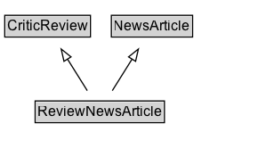

# ReviewNewsArticle

A [[NewsArticle]] and [[CriticReview]] providing a professional critic's assessment of a service, product, performance, or artistic or literary work.

## Diagram

=== "SVG (interactive)"

    <!-- Generated by graphviz version 14.1.3 (20260303.0454)
     -->
    <!-- Pages: 1 -->
    <svg width="231pt" height="132pt"
     viewBox="0.00 0.00 231.00 132.00" xmlns="http://www.w3.org/2000/svg" xmlns:xlink="http://www.w3.org/1999/xlink">
    <g id="graph0" class="graph" transform="scale(1 1) rotate(0) translate(4 128)">
    <polygon fill="white" stroke="none" points="-4,4 -4,-128 227.12,-128 227.12,4 -4,4"/>
    <g id="clust3" class="cluster">
    <title>cluster_associated</title>
    </g>
    <!-- CriticReview -->
    <g id="node1" class="node">
    <title>CriticReview</title>
    <g id="a_node1"><a xlink:href="../CriticReview" xlink:title="&lt;TABLE&gt;">
    <polygon fill="lightgray" stroke="none" points="1,-97.88 1,-114.12 71.25,-114.12 71.25,-97.88 1,-97.88"/>
    <text xml:space="preserve" text-anchor="start" x="2" y="-101.88" font-family="Arial" font-size="12.00">CriticReview</text>
    <polygon fill="none" stroke="black" points="0,-96.88 0,-115.12 72.25,-115.12 72.25,-96.88 0,-96.88"/>
    </a>
    </g>
    </g>
    <!-- NewsArticle -->
    <g id="node2" class="node">
    <title>NewsArticle</title>
    <g id="a_node2"><a xlink:href="../NewsArticle" xlink:title="&lt;TABLE&gt;">
    <polygon fill="lightgray" stroke="none" points="90.88,-97.88 90.88,-114.12 157.38,-114.12 157.38,-97.88 90.88,-97.88"/>
    <text xml:space="preserve" text-anchor="start" x="91.88" y="-101.88" font-family="Arial" font-size="12.00">NewsArticle</text>
    <polygon fill="none" stroke="black" points="89.88,-96.88 89.88,-115.12 158.38,-115.12 158.38,-96.88 89.88,-96.88"/>
    </a>
    </g>
    </g>
    <!-- ReviewNewsArticle -->
    <g id="node3" class="node">
    <title>ReviewNewsArticle</title>
    <g id="a_node3"><a xlink:href="../ReviewNewsArticle" xlink:title="&lt;TABLE&gt;">
    <polygon fill="lightgray" stroke="none" points="26.62,-25.88 26.62,-42.12 133.62,-42.12 133.62,-25.88 26.62,-25.88"/>
    <text xml:space="preserve" text-anchor="start" x="27.62" y="-29.88" font-family="Arial" font-size="12.00">ReviewNewsArticle</text>
    <polygon fill="none" stroke="black" points="25.62,-24.88 25.62,-43.12 134.62,-43.12 134.62,-24.88 25.62,-24.88"/>
    </a>
    </g>
    </g>
    <!-- ReviewNewsArticle&#45;&gt;CriticReview -->
    <g id="edge1" class="edge">
    <title>ReviewNewsArticle&#45;&gt;CriticReview</title>
    <path fill="none" stroke="black" d="M69.57,-51.79C64.56,-59.76 58.45,-69.48 52.83,-78.43"/>
    <polygon fill="none" stroke="black" points="49.94,-76.44 47.58,-86.77 55.87,-80.17 49.94,-76.44"/>
    </g>
    <!-- ReviewNewsArticle&#45;&gt;NewsArticle -->
    <g id="edge2" class="edge">
    <title>ReviewNewsArticle&#45;&gt;NewsArticle</title>
    <path fill="none" stroke="black" d="M90.68,-51.79C95.69,-59.76 101.8,-69.48 107.42,-78.43"/>
    <polygon fill="none" stroke="black" points="104.38,-80.17 112.67,-86.77 110.31,-76.44 104.38,-80.17"/>
    </g>
    <!-- Invis -->
    </g>
    </svg>

=== "PNG"

    

## Formalization for ReviewNewsArticle

| Property | Constraint |
|----------|------------|
| subClassOf | [CriticReview](CriticReview.md) |
| subClassOf | [NewsArticle](NewsArticle.md) |

