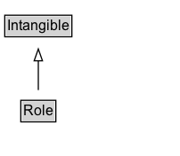

# Role

Represents additional information about a relationship or property. For example a Role can be used to say that a 'member' role linking some SportsTeam to a player occurred during a particular time period. Or that a Person's 'actor' role in a Movie was for some particular characterName. Such properties can be attached to a Role entity, which is then associated with the main entities using ordinary properties like 'member' or 'actor'.\n\nSee also [blog post](https://blog.schema.org/2014/06/16/introducing-role/).

## Diagram

=== "SVG (interactive)"

    <!-- Generated by graphviz version 14.1.3 (20260303.0454)
     -->
    <!-- Pages: 1 -->
    <svg width="151pt" height="132pt"
     viewBox="0.00 0.00 151.00 132.00" xmlns="http://www.w3.org/2000/svg" xmlns:xlink="http://www.w3.org/1999/xlink">
    <g id="graph0" class="graph" transform="scale(1 1) rotate(0) translate(4 128)">
    <polygon fill="white" stroke="none" points="-4,4 -4,-128 147.25,-128 147.25,4 -4,4"/>
    <g id="clust3" class="cluster">
    <title>cluster_associated</title>
    </g>
    <!-- Intangible -->
    <g id="node1" class="node">
    <title>Intangible</title>
    <g id="a_node1"><a xlink:href="../Intangible" xlink:title="&lt;TABLE&gt;">
    <polygon fill="lightgray" stroke="none" points="1,-97.88 1,-114.12 55.5,-114.12 55.5,-97.88 1,-97.88"/>
    <text xml:space="preserve" text-anchor="start" x="2" y="-101.88" font-family="Arial" font-size="12.00">Intangible</text>
    <polygon fill="none" stroke="black" points="0,-96.88 0,-115.12 56.5,-115.12 56.5,-96.88 0,-96.88"/>
    </a>
    </g>
    </g>
    <!-- Role -->
    <g id="node2" class="node">
    <title>Role</title>
    <g id="a_node2"><a xlink:href="../Role" xlink:title="&lt;TABLE&gt;">
    <polygon fill="lightgray" stroke="none" points="14.5,-25.88 14.5,-42.12 42,-42.12 42,-25.88 14.5,-25.88"/>
    <text xml:space="preserve" text-anchor="start" x="15.5" y="-29.88" font-family="Arial" font-size="12.00">Role</text>
    <polygon fill="none" stroke="black" points="13.5,-24.88 13.5,-43.12 43,-43.12 43,-24.88 13.5,-24.88"/>
    </a>
    </g>
    </g>
    <!-- Role&#45;&gt;Intangible -->
    <g id="edge1" class="edge">
    <title>Role&#45;&gt;Intangible</title>
    <path fill="none" stroke="black" d="M28.25,-51.79C28.25,-59.25 28.25,-68.24 28.25,-76.69"/>
    <polygon fill="none" stroke="black" points="24.75,-76.54 28.25,-86.54 31.75,-76.54 24.75,-76.54"/>
    </g>
    <!-- Invis -->
    </g>
    </svg>

=== "PNG"

    

## Specializations of Role

| Class | Description |
|-------|-------------|
| [Employee Role](EmployeeRole.md) | A subclass of OrganizationRole used to describe employee relationships. |
| [Link Role](LinkRole.md) | A Role that represents a Web link, e.g. as expressed via the 'url' property. Its linkRelationship property can indicate URL-based and plain textual link types, e.g. those in IANA link registry or others such as 'amphtml'. This structure provides a placeholder where details from HTML's link element can be represented outside of HTML, e.g. in JSON-LD feeds. |
| [Organization Role](OrganizationRole.md) | A subclass of Role used to describe roles within organizations. |
| [Performance Role](PerformanceRole.md) | A PerformanceRole is a Role that some entity places with regard to a theatrical performance, e.g. in a Movie, TVSeries etc. |

## Formalization for Role

| Property | Constraint |
|----------|------------|
| subClassOf | [Intangible](Intangible.md) |

