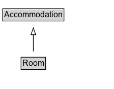

# Room

A room is a distinguishable space within a structure, usually separated from other spaces by interior walls (source: Wikipedia, the free encyclopedia, see <a href="http://en.wikipedia.org/wiki/Room">http://en.wikipedia.org/wiki/Room</a>).
  
See also the <a href="/docs/hotels.html">dedicated document on the use of schema.org for marking up hotels and other forms of accommodations</a>.

## Diagram

=== "SVG (interactive)"

    <!-- Generated by graphviz version 14.1.3 (20260303.0454)
     -->
    <!-- Pages: 1 -->
    <svg width="168pt" height="132pt"
     viewBox="0.00 0.00 168.00 132.00" xmlns="http://www.w3.org/2000/svg" xmlns:xlink="http://www.w3.org/1999/xlink">
    <g id="graph0" class="graph" transform="scale(1 1) rotate(0) translate(4 128)">
    <polygon fill="white" stroke="none" points="-4,4 -4,-128 164.12,-128 164.12,4 -4,4"/>
    <g id="clust3" class="cluster">
    <title>cluster_associated</title>
    </g>
    <!-- Accommodation -->
    <g id="node1" class="node">
    <title>Accommodation</title>
    <g id="a_node1"><a xlink:href="../Accommodation" xlink:title="&lt;TABLE&gt;">
    <polygon fill="lightgray" stroke="none" points="1,-97.88 1,-114.12 89.25,-114.12 89.25,-97.88 1,-97.88"/>
    <text xml:space="preserve" text-anchor="start" x="2" y="-101.88" font-family="Arial" font-size="12.00">Accommodation</text>
    <polygon fill="none" stroke="black" points="0,-96.88 0,-115.12 90.25,-115.12 90.25,-96.88 0,-96.88"/>
    </a>
    </g>
    </g>
    <!-- Room -->
    <g id="node2" class="node">
    <title>Room</title>
    <g id="a_node2"><a xlink:href="../Room" xlink:title="&lt;TABLE&gt;">
    <polygon fill="lightgray" stroke="none" points="28,-25.88 28,-42.12 62.25,-42.12 62.25,-25.88 28,-25.88"/>
    <text xml:space="preserve" text-anchor="start" x="29" y="-29.88" font-family="Arial" font-size="12.00">Room</text>
    <polygon fill="none" stroke="black" points="27,-24.88 27,-43.12 63.25,-43.12 63.25,-24.88 27,-24.88"/>
    </a>
    </g>
    </g>
    <!-- Room&#45;&gt;Accommodation -->
    <g id="edge1" class="edge">
    <title>Room&#45;&gt;Accommodation</title>
    <path fill="none" stroke="black" d="M45.12,-51.79C45.12,-59.25 45.12,-68.24 45.12,-76.69"/>
    <polygon fill="none" stroke="black" points="41.63,-76.54 45.13,-86.54 48.63,-76.54 41.63,-76.54"/>
    </g>
    <!-- Invis -->
    </g>
    </svg>

=== "PNG"

    

## Specializations of Room

| Class | Description |
|-------|-------------|
| [Hotel Room](HotelRoom.md) | A hotel room is a single room in a hotel.
  
See also the <a href="/docs/hotels.html">dedicated document on the use of schema.org for marking up hotels and other forms of accommodations</a>.
 |
| [Meeting Room](MeetingRoom.md) | A meeting room, conference room, or conference hall is a room provided for singular events such as business conferences and meetings (source: Wikipedia, the free encyclopedia, see <a href="http://en.wikipedia.org/wiki/Conference_hall">http://en.wikipedia.org/wiki/Conference_hall</a>).
  
See also the <a href="/docs/hotels.html">dedicated document on the use of schema.org for marking up hotels and other forms of accommodations</a>.
 |

## Formalization for Room

| Property | Constraint |
|----------|------------|
| subClassOf | [Accommodation](Accommodation.md) |

