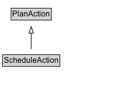

# ScheduleAction

Scheduling future actions, events, or tasks.\n\nRelated actions:\n\n* [[ReserveAction]]: Unlike ReserveAction, ScheduleAction allocates future actions (e.g. an event, a task, etc) towards a time slot / spatial allocation.

## Diagram

=== "SVG (interactive)"

    <!-- Generated by graphviz version 14.1.3 (20260303.0454)
     -->
    <!-- Pages: 1 -->
    <svg width="184pt" height="132pt"
     viewBox="0.00 0.00 184.00 132.00" xmlns="http://www.w3.org/2000/svg" xmlns:xlink="http://www.w3.org/1999/xlink">
    <g id="graph0" class="graph" transform="scale(1 1) rotate(0) translate(4 128)">
    <polygon fill="white" stroke="none" points="-4,4 -4,-128 180.38,-128 180.38,4 -4,4"/>
    <g id="clust3" class="cluster">
    <title>cluster_associated</title>
    </g>
    <!-- PlanAction -->
    <g id="node1" class="node">
    <title>PlanAction</title>
    <g id="a_node1"><a xlink:href="../PlanAction" xlink:title="&lt;TABLE&gt;">
    <polygon fill="lightgray" stroke="none" points="14.12,-97.88 14.12,-114.12 74.62,-114.12 74.62,-97.88 14.12,-97.88"/>
    <text xml:space="preserve" text-anchor="start" x="15.12" y="-101.88" font-family="Arial" font-size="12.00">PlanAction</text>
    <polygon fill="none" stroke="black" points="13.12,-96.88 13.12,-115.12 75.62,-115.12 75.62,-96.88 13.12,-96.88"/>
    </a>
    </g>
    </g>
    <!-- ScheduleAction -->
    <g id="node2" class="node">
    <title>ScheduleAction</title>
    <g id="a_node2"><a xlink:href="../ScheduleAction" xlink:title="&lt;TABLE&gt;">
    <polygon fill="lightgray" stroke="none" points="1,-25.88 1,-42.12 87.75,-42.12 87.75,-25.88 1,-25.88"/>
    <text xml:space="preserve" text-anchor="start" x="2" y="-29.88" font-family="Arial" font-size="12.00">ScheduleAction</text>
    <polygon fill="none" stroke="black" points="0,-24.88 0,-43.12 88.75,-43.12 88.75,-24.88 0,-24.88"/>
    </a>
    </g>
    </g>
    <!-- ScheduleAction&#45;&gt;PlanAction -->
    <g id="edge1" class="edge">
    <title>ScheduleAction&#45;&gt;PlanAction</title>
    <path fill="none" stroke="black" d="M44.38,-51.79C44.38,-59.25 44.38,-68.24 44.38,-76.69"/>
    <polygon fill="none" stroke="black" points="40.88,-76.54 44.38,-86.54 47.88,-76.54 40.88,-76.54"/>
    </g>
    <!-- Invis -->
    </g>
    </svg>

=== "PNG"

    

## Formalization for ScheduleAction

| Property | Constraint |
|----------|------------|
| subClassOf | [PlanAction](PlanAction.md) |

