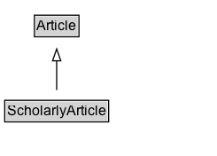

# ScholarlyArticle

A scholarly article.

## Diagram

=== "SVG (interactive)"

    <!-- Generated by graphviz version 14.1.3 (20260303.0454)
     -->
    <!-- Pages: 1 -->
    <svg width="184pt" height="132pt"
     viewBox="0.00 0.00 184.00 132.00" xmlns="http://www.w3.org/2000/svg" xmlns:xlink="http://www.w3.org/1999/xlink">
    <g id="graph0" class="graph" transform="scale(1 1) rotate(0) translate(4 128)">
    <polygon fill="white" stroke="none" points="-4,4 -4,-128 180,-128 180,4 -4,4"/>
    <g id="clust3" class="cluster">
    <title>cluster_associated</title>
    </g>
    <!-- Article -->
    <g id="node1" class="node">
    <title>Article</title>
    <g id="a_node1"><a xlink:href="../Article" xlink:title="&lt;TABLE&gt;">
    <polygon fill="lightgray" stroke="none" points="26.12,-97.88 26.12,-114.12 61.88,-114.12 61.88,-97.88 26.12,-97.88"/>
    <text xml:space="preserve" text-anchor="start" x="27.12" y="-101.88" font-family="Arial" font-size="12.00">Article</text>
    <polygon fill="none" stroke="black" points="25.12,-96.88 25.12,-115.12 62.88,-115.12 62.88,-96.88 25.12,-96.88"/>
    </a>
    </g>
    </g>
    <!-- ScholarlyArticle -->
    <g id="node2" class="node">
    <title>ScholarlyArticle</title>
    <g id="a_node2"><a xlink:href="../ScholarlyArticle" xlink:title="&lt;TABLE&gt;">
    <polygon fill="lightgray" stroke="none" points="1,-25.88 1,-42.12 87,-42.12 87,-25.88 1,-25.88"/>
    <text xml:space="preserve" text-anchor="start" x="2" y="-29.88" font-family="Arial" font-size="12.00">ScholarlyArticle</text>
    <polygon fill="none" stroke="black" points="0,-24.88 0,-43.12 88,-43.12 88,-24.88 0,-24.88"/>
    </a>
    </g>
    </g>
    <!-- ScholarlyArticle&#45;&gt;Article -->
    <g id="edge1" class="edge">
    <title>ScholarlyArticle&#45;&gt;Article</title>
    <path fill="none" stroke="black" d="M44,-51.79C44,-59.25 44,-68.24 44,-76.69"/>
    <polygon fill="none" stroke="black" points="40.5,-76.54 44,-86.54 47.5,-76.54 40.5,-76.54"/>
    </g>
    <!-- Invis -->
    </g>
    </svg>

=== "PNG"

    

## Specializations of ScholarlyArticle

| Class | Description |
|-------|-------------|
| [Medical Scholarly Article](MedicalScholarlyArticle.md) | A scholarly article in the medical domain. |

## Formalization for ScholarlyArticle

| Property | Constraint |
|----------|------------|
| subClassOf | [Article](Article.md) |

