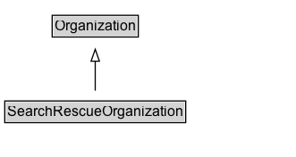

# SearchRescueOrganization

A Search and Rescue organization of some kind.

## Diagram

=== "SVG (interactive)"

    <!-- Generated by graphviz version 14.1.3 (20260303.0454)
     -->
    <!-- Pages: 1 -->
    <svg width="248pt" height="132pt"
     viewBox="0.00 0.00 248.00 132.00" xmlns="http://www.w3.org/2000/svg" xmlns:xlink="http://www.w3.org/1999/xlink">
    <g id="graph0" class="graph" transform="scale(1 1) rotate(0) translate(4 128)">
    <polygon fill="white" stroke="none" points="-4,4 -4,-128 243.88,-128 243.88,4 -4,4"/>
    <g id="clust3" class="cluster">
    <title>cluster_associated</title>
    </g>
    <!-- Organization -->
    <g id="node1" class="node">
    <title>Organization</title>
    <g id="a_node1"><a xlink:href="../Organization" xlink:title="&lt;TABLE&gt;">
    <polygon fill="lightgray" stroke="none" points="40.75,-97.88 40.75,-114.12 111,-114.12 111,-97.88 40.75,-97.88"/>
    <text xml:space="preserve" text-anchor="start" x="41.75" y="-101.88" font-family="Arial" font-size="12.00">Organization</text>
    <polygon fill="none" stroke="black" points="39.75,-96.88 39.75,-115.12 112,-115.12 112,-96.88 39.75,-96.88"/>
    </a>
    </g>
    </g>
    <!-- SearchRescueOrganization -->
    <g id="node2" class="node">
    <title>SearchRescueOrganization</title>
    <g id="a_node2"><a xlink:href="../SearchRescueOrganization" xlink:title="&lt;TABLE&gt;">
    <polygon fill="lightgray" stroke="none" points="1,-25.88 1,-42.12 150.75,-42.12 150.75,-25.88 1,-25.88"/>
    <text xml:space="preserve" text-anchor="start" x="2" y="-29.88" font-family="Arial" font-size="12.00">SearchRescueOrganization</text>
    <polygon fill="none" stroke="black" points="0,-24.88 0,-43.12 151.75,-43.12 151.75,-24.88 0,-24.88"/>
    </a>
    </g>
    </g>
    <!-- SearchRescueOrganization&#45;&gt;Organization -->
    <g id="edge1" class="edge">
    <title>SearchRescueOrganization&#45;&gt;Organization</title>
    <path fill="none" stroke="black" d="M75.88,-51.79C75.88,-59.25 75.88,-68.24 75.88,-76.69"/>
    <polygon fill="none" stroke="black" points="72.38,-76.54 75.88,-86.54 79.38,-76.54 72.38,-76.54"/>
    </g>
    <!-- Invis -->
    </g>
    </svg>

=== "PNG"

    

## Formalization for SearchRescueOrganization

| Property | Constraint |
|----------|------------|
| subClassOf | [Organization](Organization.md) |

