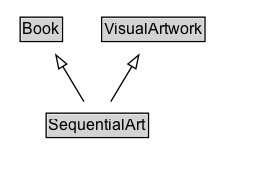

# SequentialArt

An art forms that use images deployed in a specific order for the purpose of graphic storytelling (i.e., narration of graphic stories) or conveying information. Examples of SequentialArt are Franco-Belgian Bande Dessinée, Comics in the USA and 漫画 (Manga) in Japan.

## Diagram

=== "SVG (interactive)"

    <!-- Generated by graphviz version 14.1.3 (20260303.0454)
     -->
    <!-- Pages: 1 -->
    <svg width="203pt" height="132pt"
     viewBox="0.00 0.00 203.00 132.00" xmlns="http://www.w3.org/2000/svg" xmlns:xlink="http://www.w3.org/1999/xlink">
    <g id="graph0" class="graph" transform="scale(1 1) rotate(0) translate(4 128)">
    <polygon fill="white" stroke="none" points="-4,4 -4,-128 199,-128 199,4 -4,4"/>
    <g id="clust3" class="cluster">
    <title>cluster_associated</title>
    </g>
    <!-- Book -->
    <g id="node1" class="node">
    <title>Book</title>
    <g id="a_node1"><a xlink:href="../Book" xlink:title="&lt;TABLE&gt;">
    <polygon fill="lightgray" stroke="none" points="12.12,-97.88 12.12,-114.12 41.88,-114.12 41.88,-97.88 12.12,-97.88"/>
    <text xml:space="preserve" text-anchor="start" x="13.12" y="-101.88" font-family="Arial" font-size="12.00">Book</text>
    <polygon fill="none" stroke="black" points="11.12,-96.88 11.12,-115.12 42.88,-115.12 42.88,-96.88 11.12,-96.88"/>
    </a>
    </g>
    </g>
    <!-- VisualArtwork -->
    <g id="node2" class="node">
    <title>VisualArtwork</title>
    <g id="a_node2"><a xlink:href="../VisualArtwork" xlink:title="&lt;TABLE&gt;">
    <polygon fill="lightgray" stroke="none" points="73.25,-97.88 73.25,-114.12 148.75,-114.12 148.75,-97.88 73.25,-97.88"/>
    <text xml:space="preserve" text-anchor="start" x="74.25" y="-101.88" font-family="Arial" font-size="12.00">VisualArtwork</text>
    <polygon fill="none" stroke="black" points="72.25,-96.88 72.25,-115.12 149.75,-115.12 149.75,-96.88 72.25,-96.88"/>
    </a>
    </g>
    </g>
    <!-- SequentialArt -->
    <g id="node3" class="node">
    <title>SequentialArt</title>
    <g id="a_node3"><a xlink:href="../SequentialArt" xlink:title="&lt;TABLE&gt;">
    <polygon fill="lightgray" stroke="none" points="31.62,-25.88 31.62,-42.12 106.38,-42.12 106.38,-25.88 31.62,-25.88"/>
    <text xml:space="preserve" text-anchor="start" x="32.62" y="-29.88" font-family="Arial" font-size="12.00">SequentialArt</text>
    <polygon fill="none" stroke="black" points="30.62,-24.88 30.62,-43.12 107.38,-43.12 107.38,-24.88 30.62,-24.88"/>
    </a>
    </g>
    </g>
    <!-- SequentialArt&#45;&gt;Book -->
    <g id="edge1" class="edge">
    <title>SequentialArt&#45;&gt;Book</title>
    <path fill="none" stroke="black" d="M58.93,-51.79C54.14,-59.76 48.31,-69.48 42.94,-78.43"/>
    <polygon fill="none" stroke="black" points="40.09,-76.38 37.95,-86.76 46.09,-79.98 40.09,-76.38"/>
    </g>
    <!-- SequentialArt&#45;&gt;VisualArtwork -->
    <g id="edge2" class="edge">
    <title>SequentialArt&#45;&gt;VisualArtwork</title>
    <path fill="none" stroke="black" d="M79.07,-51.79C83.86,-59.76 89.69,-69.48 95.06,-78.43"/>
    <polygon fill="none" stroke="black" points="91.91,-79.98 100.05,-86.76 97.91,-76.38 91.91,-79.98"/>
    </g>
    <!-- Invis -->
    </g>
    </svg>

=== "PNG"

    

## Formalization for SequentialArt

| Property | Constraint |
|----------|------------|
| subClassOf | [Book](Book.md) |
| subClassOf | [VisualArtwork](VisualArtwork.md) |

