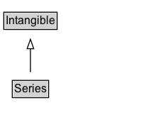

# Series

A Series in schema.org is a group of related items, typically but not necessarily of the same kind. See also [[CreativeWorkSeries]], [[EventSeries]].

## Diagram

=== "SVG (interactive)"

    <!-- Generated by graphviz version 14.1.3 (20260303.0454)
     -->
    <!-- Pages: 1 -->
    <svg width="151pt" height="132pt"
     viewBox="0.00 0.00 151.00 132.00" xmlns="http://www.w3.org/2000/svg" xmlns:xlink="http://www.w3.org/1999/xlink">
    <g id="graph0" class="graph" transform="scale(1 1) rotate(0) translate(4 128)">
    <polygon fill="white" stroke="none" points="-4,4 -4,-128 147.25,-128 147.25,4 -4,4"/>
    <g id="clust3" class="cluster">
    <title>cluster_associated</title>
    </g>
    <!-- Intangible -->
    <g id="node1" class="node">
    <title>Intangible</title>
    <g id="a_node1"><a xlink:href="../Intangible" xlink:title="&lt;TABLE&gt;">
    <polygon fill="lightgray" stroke="none" points="1,-97.88 1,-114.12 55.5,-114.12 55.5,-97.88 1,-97.88"/>
    <text xml:space="preserve" text-anchor="start" x="2" y="-101.88" font-family="Arial" font-size="12.00">Intangible</text>
    <polygon fill="none" stroke="black" points="0,-96.88 0,-115.12 56.5,-115.12 56.5,-96.88 0,-96.88"/>
    </a>
    </g>
    </g>
    <!-- Series -->
    <g id="node2" class="node">
    <title>Series</title>
    <g id="a_node2"><a xlink:href="../Series" xlink:title="&lt;TABLE&gt;">
    <polygon fill="lightgray" stroke="none" points="10,-25.88 10,-42.12 46.5,-42.12 46.5,-25.88 10,-25.88"/>
    <text xml:space="preserve" text-anchor="start" x="11" y="-29.88" font-family="Arial" font-size="12.00">Series</text>
    <polygon fill="none" stroke="black" points="9,-24.88 9,-43.12 47.5,-43.12 47.5,-24.88 9,-24.88"/>
    </a>
    </g>
    </g>
    <!-- Series&#45;&gt;Intangible -->
    <g id="edge1" class="edge">
    <title>Series&#45;&gt;Intangible</title>
    <path fill="none" stroke="black" d="M28.25,-51.79C28.25,-59.25 28.25,-68.24 28.25,-76.69"/>
    <polygon fill="none" stroke="black" points="24.75,-76.54 28.25,-86.54 31.75,-76.54 24.75,-76.54"/>
    </g>
    <!-- Invis -->
    </g>
    </svg>

=== "PNG"

    

## Specializations of Series

| Class | Description |
|-------|-------------|
| [Book Series](BookSeries.md) | A series of books. Included books can be indicated with the hasPart property. |
| [Comic Series](ComicSeries.md) | A sequential publication of comic stories under a
    	unifying title, for example "The Amazing Spider-Man" or "Groo the
    	Wanderer". |
| [Creative Work Series](CreativeWorkSeries.md) | A CreativeWorkSeries in schema.org is a group of related items, typically but not necessarily of the same kind. CreativeWorkSeries are usually organized into some order, often chronological. Unlike [[ItemList]] which is a general purpose data structure for lists of things, the emphasis with CreativeWorkSeries is on published materials (written e.g. books and periodicals, or media such as TV, radio and games).\n\nSpecific subtypes are available for describing [[TVSeries]], [[RadioSeries]], [[MovieSeries]], [[BookSeries]], [[Periodical]] and [[VideoGameSeries]]. In each case, the [[hasPart]] / [[isPartOf]] properties can be used to relate the CreativeWorkSeries to its parts. The general CreativeWorkSeries type serves largely just to organize these more specific and practical subtypes.\n\nIt is common for properties applicable to an item from the series to be usefully applied to the containing group. Schema.org attempts to anticipate some of these cases, but publishers should be free to apply properties of the series parts to the series as a whole wherever they seem appropriate.
     |
| [Event Series](EventSeries.md) | A series of [[Event]]s. Included events can relate with the series using the [[superEvent]] property.

An EventSeries is a collection of events that share some unifying characteristic. For example, "The Olympic Games" is a series, which
is repeated regularly. The "2012 London Olympics" can be presented both as an [[Event]] in the series "Olympic Games", and as an
[[EventSeries]] that included a number of sporting competitions as Events.

The nature of the association between the events in an [[EventSeries]] can vary, but typical examples could
include a thematic event series (e.g. topical meetups or classes), or a series of regular events that share a location, attendee group and/or organizers.

EventSeries has been defined as a kind of Event to make it easy for publishers to use it in an Event context without
worrying about which kinds of series are really event-like enough to call an Event. In general an EventSeries
may seem more Event-like when the period of time is compact and when aspects such as location are fixed, but
it may also sometimes prove useful to describe a longer-term series as an Event.
    |
| [Movie Series](MovieSeries.md) | A series of movies. Included movies can be indicated with the hasPart property. |
| [Newspaper](Newspaper.md) | A publication containing information about varied topics that are pertinent to general information, a geographic area, or a specific subject matter (i.e. business, culture, education). Often published daily. |
| [Periodical](Periodical.md) | A publication in any medium issued in successive parts bearing numerical or chronological designations and intended to continue indefinitely, such as a magazine, scholarly journal, or newspaper.\n\nSee also [blog post](https://blog.schema.org/2014/09/02/schema-org-support-for-bibliographic-relationships-and-periodicals/). |
| [Podcast Series](PodcastSeries.md) | A podcast is an episodic series of digital audio or video files which a user can download and listen to. |
| [Radio Series](RadioSeries.md) | CreativeWorkSeries dedicated to radio broadcast and associated online delivery. |
| [Tv Series](TVSeries.md) | CreativeWorkSeries dedicated to TV broadcast and associated online delivery. |
| [Video Game Series](VideoGameSeries.md) | A video game series. |

## Formalization for Series

| Property | Constraint |
|----------|------------|
| subClassOf | [Intangible](Intangible.md) |

