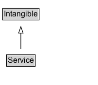

# Service

A service provided by an organization, e.g. delivery service, print services, etc.

## Diagram

=== "SVG (interactive)"

    <!-- Generated by graphviz version 14.1.3 (20260303.0454)
     -->
    <!-- Pages: 1 -->
    <svg width="151pt" height="132pt"
     viewBox="0.00 0.00 151.00 132.00" xmlns="http://www.w3.org/2000/svg" xmlns:xlink="http://www.w3.org/1999/xlink">
    <g id="graph0" class="graph" transform="scale(1 1) rotate(0) translate(4 128)">
    <polygon fill="white" stroke="none" points="-4,4 -4,-128 147.25,-128 147.25,4 -4,4"/>
    <g id="clust3" class="cluster">
    <title>cluster_associated</title>
    </g>
    <!-- Intangible -->
    <g id="node1" class="node">
    <title>Intangible</title>
    <g id="a_node1"><a xlink:href="../Intangible" xlink:title="&lt;TABLE&gt;">
    <polygon fill="lightgray" stroke="none" points="1,-97.88 1,-114.12 55.5,-114.12 55.5,-97.88 1,-97.88"/>
    <text xml:space="preserve" text-anchor="start" x="2" y="-101.88" font-family="Arial" font-size="12.00">Intangible</text>
    <polygon fill="none" stroke="black" points="0,-96.88 0,-115.12 56.5,-115.12 56.5,-96.88 0,-96.88"/>
    </a>
    </g>
    </g>
    <!-- Service -->
    <g id="node2" class="node">
    <title>Service</title>
    <g id="a_node2"><a xlink:href="../Service" xlink:title="&lt;TABLE&gt;">
    <polygon fill="lightgray" stroke="none" points="7,-25.88 7,-42.12 49.5,-42.12 49.5,-25.88 7,-25.88"/>
    <text xml:space="preserve" text-anchor="start" x="8" y="-29.88" font-family="Arial" font-size="12.00">Service</text>
    <polygon fill="none" stroke="black" points="6,-24.88 6,-43.12 50.5,-43.12 50.5,-24.88 6,-24.88"/>
    </a>
    </g>
    </g>
    <!-- Service&#45;&gt;Intangible -->
    <g id="edge1" class="edge">
    <title>Service&#45;&gt;Intangible</title>
    <path fill="none" stroke="black" d="M28.25,-51.79C28.25,-59.25 28.25,-68.24 28.25,-76.69"/>
    <polygon fill="none" stroke="black" points="24.75,-76.54 28.25,-86.54 31.75,-76.54 24.75,-76.54"/>
    </g>
    <!-- Invis -->
    </g>
    </svg>

=== "PNG"

    

## Specializations of Service

| Class | Description |
|-------|-------------|
| [Bank Account](BankAccount.md) | A product or service offered by a bank whereby one may deposit, withdraw or transfer money and in some cases be paid interest. |
| [Broadcast Service](BroadcastService.md) | A delivery service through which content is provided via broadcast over the air or online. |
| [Brokerage Account](BrokerageAccount.md) | An account that allows an investor to deposit funds and place investment orders with a licensed broker or brokerage firm. |
| [Cable Or Satellite Service](CableOrSatelliteService.md) | A service which provides access to media programming like TV or radio. Access may be via cable or satellite. |
| [Credit Card](CreditCard.md) | A card payment method of a particular brand or name.  Used to mark up a particular payment method and/or the financial product/service that supplies the card account.\n\nCommonly used values:\n\n* http://purl.org/goodrelations/v1#AmericanExpress\n* http://purl.org/goodrelations/v1#DinersClub\n* http://purl.org/goodrelations/v1#Discover\n* http://purl.org/goodrelations/v1#JCB\n* http://purl.org/goodrelations/v1#MasterCard\n* http://purl.org/goodrelations/v1#VISA
        |
| [Credit Card](CreditCard.md) | A card payment method of a particular brand or name.  Used to mark up a particular payment method and/or the financial product/service that supplies the card account.\n\nCommonly used values:\n\n* http://purl.org/goodrelations/v1#AmericanExpress\n* http://purl.org/goodrelations/v1#DinersClub\n* http://purl.org/goodrelations/v1#Discover\n* http://purl.org/goodrelations/v1#JCB\n* http://purl.org/goodrelations/v1#MasterCard\n* http://purl.org/goodrelations/v1#VISA
        |
| [Currency Conversion Service](CurrencyConversionService.md) | A service to convert funds from one currency to another currency. |
| [Deposit Account](DepositAccount.md) | A type of Bank Account with a main purpose of depositing funds to gain interest or other benefits. |
| [Deposit Account](DepositAccount.md) | A type of Bank Account with a main purpose of depositing funds to gain interest or other benefits. |
| [Financial Product](FinancialProduct.md) | A product provided to consumers and businesses by financial institutions such as banks, insurance companies, brokerage firms, consumer finance companies, and investment companies which comprise the financial services industry. |
| [Food Service](FoodService.md) | A food service, like breakfast, lunch, or dinner. |
| [Government Service](GovernmentService.md) | A service provided by a government organization, e.g. food stamps, veterans benefits, etc. |
| [Investment Fund](InvestmentFund.md) | A company or fund that gathers capital from a number of investors to create a pool of money that is then re-invested into stocks, bonds and other assets. |
| [Investment Or Deposit](InvestmentOrDeposit.md) | A type of financial product that typically requires the client to transfer funds to a financial service in return for potential beneficial financial return. |
| [Loan Or Credit](LoanOrCredit.md) | A financial product for the loaning of an amount of money, or line of credit, under agreed terms and charges. |
| [Mortgage Loan](MortgageLoan.md) | A loan in which property or real estate is used as collateral. (A loan securitized against some real estate.) |
| [Payment Card](PaymentCard.md) | A payment method using a credit, debit, store or other card to associate the payment with an account. |
| [Payment Service](PaymentService.md) | A Service to transfer funds from a person or organization to a beneficiary person or organization. |
| [Radio Broadcast Service](RadioBroadcastService.md) | A delivery service through which radio content is provided via broadcast over the air or online. |
| [Taxi](Taxi.md) | A taxi. |
| [Taxi Service](TaxiService.md) | A service for a vehicle for hire with a driver for local travel. Fares are usually calculated based on distance traveled. |
| [Web Api](WebAPI.md) | An application programming interface accessible over Web/Internet technologies. |

## Formalization for Service

| Property | Constraint |
|----------|------------|
| subClassOf | [Intangible](Intangible.md) |

