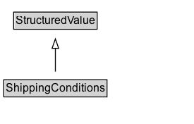

# ShippingConditions

ShippingConditions represent a set of constraints and information about the conditions of shipping a product. Such conditions may apply to only a subset of the products being shipped, depending on aspects of the product like weight, size, price, destination, and others. All the specified conditions must be met for this ShippingConditions to apply.

## Diagram

=== "SVG (interactive)"

    <!-- Generated by graphviz version 14.1.3 (20260303.0454)
     -->
    <!-- Pages: 1 -->
    <svg width="206pt" height="132pt"
     viewBox="0.00 0.00 206.00 132.00" xmlns="http://www.w3.org/2000/svg" xmlns:xlink="http://www.w3.org/1999/xlink">
    <g id="graph0" class="graph" transform="scale(1 1) rotate(0) translate(4 128)">
    <polygon fill="white" stroke="none" points="-4,4 -4,-128 201.88,-128 201.88,4 -4,4"/>
    <g id="clust3" class="cluster">
    <title>cluster_associated</title>
    </g>
    <!-- StructuredValue -->
    <g id="node1" class="node">
    <title>StructuredValue</title>
    <g id="a_node1"><a xlink:href="../StructuredValue" xlink:title="&lt;TABLE&gt;">
    <polygon fill="lightgray" stroke="none" points="11.5,-97.88 11.5,-114.12 98.25,-114.12 98.25,-97.88 11.5,-97.88"/>
    <text xml:space="preserve" text-anchor="start" x="12.5" y="-101.88" font-family="Arial" font-size="12.00">StructuredValue</text>
    <polygon fill="none" stroke="black" points="10.5,-96.88 10.5,-115.12 99.25,-115.12 99.25,-96.88 10.5,-96.88"/>
    </a>
    </g>
    </g>
    <!-- ShippingConditions -->
    <g id="node2" class="node">
    <title>ShippingConditions</title>
    <g id="a_node2"><a xlink:href="../ShippingConditions" xlink:title="&lt;TABLE&gt;">
    <polygon fill="lightgray" stroke="none" points="1,-25.88 1,-42.12 108.75,-42.12 108.75,-25.88 1,-25.88"/>
    <text xml:space="preserve" text-anchor="start" x="2" y="-29.88" font-family="Arial" font-size="12.00">ShippingConditions</text>
    <polygon fill="none" stroke="black" points="0,-24.88 0,-43.12 109.75,-43.12 109.75,-24.88 0,-24.88"/>
    </a>
    </g>
    </g>
    <!-- ShippingConditions&#45;&gt;StructuredValue -->
    <g id="edge1" class="edge">
    <title>ShippingConditions&#45;&gt;StructuredValue</title>
    <path fill="none" stroke="black" d="M54.88,-51.79C54.88,-59.25 54.88,-68.24 54.88,-76.69"/>
    <polygon fill="none" stroke="black" points="51.38,-76.54 54.88,-86.54 58.38,-76.54 51.38,-76.54"/>
    </g>
    <!-- Invis -->
    </g>
    </svg>

=== "PNG"

    

## Formalization for ShippingConditions

| Property | Constraint |
|----------|------------|
| subClassOf | [StructuredValue](StructuredValue.md) |

