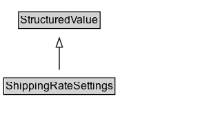

# ShippingRateSettings

A ShippingRateSettings represents re-usable pieces of shipping information. It is designed for publication on an URL that may be referenced via the [[shippingSettingsLink]] property of an [[OfferShippingDetails]]. Several occurrences can be published, distinguished and matched (i.e. identified/referenced) by their different values for [[shippingLabel]].

## Diagram

=== "SVG (interactive)"

    <!-- Generated by graphviz version 14.1.3 (20260303.0454)
     -->
    <!-- Pages: 1 -->
    <svg width="218pt" height="132pt"
     viewBox="0.00 0.00 218.00 132.00" xmlns="http://www.w3.org/2000/svg" xmlns:xlink="http://www.w3.org/1999/xlink">
    <g id="graph0" class="graph" transform="scale(1 1) rotate(0) translate(4 128)">
    <polygon fill="white" stroke="none" points="-4,4 -4,-128 213.5,-128 213.5,4 -4,4"/>
    <g id="clust3" class="cluster">
    <title>cluster_associated</title>
    </g>
    <!-- StructuredValue -->
    <g id="node1" class="node">
    <title>StructuredValue</title>
    <g id="a_node1"><a xlink:href="../StructuredValue" xlink:title="&lt;TABLE&gt;">
    <polygon fill="lightgray" stroke="none" points="17.12,-97.88 17.12,-114.12 103.88,-114.12 103.88,-97.88 17.12,-97.88"/>
    <text xml:space="preserve" text-anchor="start" x="18.12" y="-101.88" font-family="Arial" font-size="12.00">StructuredValue</text>
    <polygon fill="none" stroke="black" points="16.12,-96.88 16.12,-115.12 104.88,-115.12 104.88,-96.88 16.12,-96.88"/>
    </a>
    </g>
    </g>
    <!-- ShippingRateSettings -->
    <g id="node2" class="node">
    <title>ShippingRateSettings</title>
    <g id="a_node2"><a xlink:href="../ShippingRateSettings" xlink:title="&lt;TABLE&gt;">
    <polygon fill="lightgray" stroke="none" points="1,-25.88 1,-42.12 120,-42.12 120,-25.88 1,-25.88"/>
    <text xml:space="preserve" text-anchor="start" x="2" y="-29.88" font-family="Arial" font-size="12.00">ShippingRateSettings</text>
    <polygon fill="none" stroke="black" points="0,-24.88 0,-43.12 121,-43.12 121,-24.88 0,-24.88"/>
    </a>
    </g>
    </g>
    <!-- ShippingRateSettings&#45;&gt;StructuredValue -->
    <g id="edge1" class="edge">
    <title>ShippingRateSettings&#45;&gt;StructuredValue</title>
    <path fill="none" stroke="black" d="M60.5,-51.79C60.5,-59.25 60.5,-68.24 60.5,-76.69"/>
    <polygon fill="none" stroke="black" points="57,-76.54 60.5,-86.54 64,-76.54 57,-76.54"/>
    </g>
    <!-- Invis -->
    </g>
    </svg>

=== "PNG"

    

## Formalization for ShippingRateSettings

| Property | Constraint |
|----------|------------|
| subClassOf | [StructuredValue](StructuredValue.md) |

