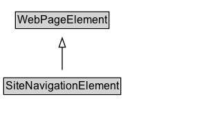

# SiteNavigationElement

A navigation element of the page.

## Diagram

=== "SVG (interactive)"

    <!-- Generated by graphviz version 14.1.3 (20260303.0454)
     -->
    <!-- Pages: 1 -->
    <svg width="224pt" height="132pt"
     viewBox="0.00 0.00 224.00 132.00" xmlns="http://www.w3.org/2000/svg" xmlns:xlink="http://www.w3.org/1999/xlink">
    <g id="graph0" class="graph" transform="scale(1 1) rotate(0) translate(4 128)">
    <polygon fill="white" stroke="none" points="-4,4 -4,-128 219.5,-128 219.5,4 -4,4"/>
    <g id="clust3" class="cluster">
    <title>cluster_associated</title>
    </g>
    <!-- WebPageElement -->
    <g id="node1" class="node">
    <title>WebPageElement</title>
    <g id="a_node1"><a xlink:href="../WebPageElement" xlink:title="&lt;TABLE&gt;">
    <polygon fill="lightgray" stroke="none" points="13.75,-97.88 13.75,-114.12 113.25,-114.12 113.25,-97.88 13.75,-97.88"/>
    <text xml:space="preserve" text-anchor="start" x="14.75" y="-101.88" font-family="Arial" font-size="12.00">WebPageElement</text>
    <polygon fill="none" stroke="black" points="12.75,-96.88 12.75,-115.12 114.25,-115.12 114.25,-96.88 12.75,-96.88"/>
    </a>
    </g>
    </g>
    <!-- SiteNavigationElement -->
    <g id="node2" class="node">
    <title>SiteNavigationElement</title>
    <g id="a_node2"><a xlink:href="../SiteNavigationElement" xlink:title="&lt;TABLE&gt;">
    <polygon fill="lightgray" stroke="none" points="1,-25.88 1,-42.12 126,-42.12 126,-25.88 1,-25.88"/>
    <text xml:space="preserve" text-anchor="start" x="2" y="-29.88" font-family="Arial" font-size="12.00">SiteNavigationElement</text>
    <polygon fill="none" stroke="black" points="0,-24.88 0,-43.12 127,-43.12 127,-24.88 0,-24.88"/>
    </a>
    </g>
    </g>
    <!-- SiteNavigationElement&#45;&gt;WebPageElement -->
    <g id="edge1" class="edge">
    <title>SiteNavigationElement&#45;&gt;WebPageElement</title>
    <path fill="none" stroke="black" d="M63.5,-51.79C63.5,-59.25 63.5,-68.24 63.5,-76.69"/>
    <polygon fill="none" stroke="black" points="60,-76.54 63.5,-86.54 67,-76.54 60,-76.54"/>
    </g>
    <!-- Invis -->
    </g>
    </svg>

=== "PNG"

    

## Formalization for SiteNavigationElement

| Property | Constraint |
|----------|------------|
| subClassOf | [WebPageElement](WebPageElement.md) |

