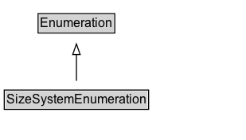

# SizeSystemEnumeration

Enumerates common size systems for different categories of products, for example "EN-13402" or "UK" for wearables or "Imperial" for screws.

## Diagram

=== "SVG (interactive)"

    <!-- Generated by graphviz version 14.1.3 (20260303.0454)
     -->
    <!-- Pages: 1 -->
    <svg width="232pt" height="132pt"
     viewBox="0.00 0.00 232.00 132.00" xmlns="http://www.w3.org/2000/svg" xmlns:xlink="http://www.w3.org/1999/xlink">
    <g id="graph0" class="graph" transform="scale(1 1) rotate(0) translate(4 128)">
    <polygon fill="white" stroke="none" points="-4,4 -4,-128 228,-128 228,4 -4,4"/>
    <g id="clust3" class="cluster">
    <title>cluster_associated</title>
    </g>
    <!-- Enumeration -->
    <g id="node1" class="node">
    <title>Enumeration</title>
    <g id="a_node1"><a xlink:href="../Enumeration" xlink:title="&lt;TABLE&gt;">
    <polygon fill="lightgray" stroke="none" points="32.88,-97.88 32.88,-114.12 103.12,-114.12 103.12,-97.88 32.88,-97.88"/>
    <text xml:space="preserve" text-anchor="start" x="33.88" y="-101.88" font-family="Arial" font-size="12.00">Enumeration</text>
    <polygon fill="none" stroke="black" points="31.88,-96.88 31.88,-115.12 104.12,-115.12 104.12,-96.88 31.88,-96.88"/>
    </a>
    </g>
    </g>
    <!-- SizeSystemEnumeration -->
    <g id="node2" class="node">
    <title>SizeSystemEnumeration</title>
    <g id="a_node2"><a xlink:href="../SizeSystemEnumeration" xlink:title="&lt;TABLE&gt;">
    <polygon fill="lightgray" stroke="none" points="1,-25.88 1,-42.12 135,-42.12 135,-25.88 1,-25.88"/>
    <text xml:space="preserve" text-anchor="start" x="2" y="-29.88" font-family="Arial" font-size="12.00">SizeSystemEnumeration</text>
    <polygon fill="none" stroke="black" points="0,-24.88 0,-43.12 136,-43.12 136,-24.88 0,-24.88"/>
    </a>
    </g>
    </g>
    <!-- SizeSystemEnumeration&#45;&gt;Enumeration -->
    <g id="edge1" class="edge">
    <title>SizeSystemEnumeration&#45;&gt;Enumeration</title>
    <path fill="none" stroke="black" d="M68,-51.79C68,-59.25 68,-68.24 68,-76.69"/>
    <polygon fill="none" stroke="black" points="64.5,-76.54 68,-86.54 71.5,-76.54 64.5,-76.54"/>
    </g>
    <!-- Invis -->
    </g>
    </svg>

=== "PNG"

    

## Specializations of SizeSystemEnumeration

| Class | Description |
|-------|-------------|
| [Wearable Size System Enumeration](WearableSizeSystemEnumeration.md) | Enumerates common size systems specific for wearable products. |

## Formalization for SizeSystemEnumeration

| Property | Constraint |
|----------|------------|
| subClassOf | [Enumeration](Enumeration.md) |

