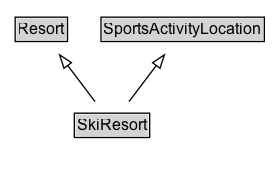

# SkiResort

A ski resort.

## Diagram

=== "SVG (interactive)"

    <!-- Generated by graphviz version 14.1.3 (20260303.0454)
     -->
    <!-- Pages: 1 -->
    <svg width="204pt" height="132pt"
     viewBox="0.00 0.00 204.00 132.00" xmlns="http://www.w3.org/2000/svg" xmlns:xlink="http://www.w3.org/1999/xlink">
    <g id="graph0" class="graph" transform="scale(1 1) rotate(0) translate(4 128)">
    <polygon fill="white" stroke="none" points="-4,4 -4,-128 200,-128 200,4 -4,4"/>
    <g id="clust3" class="cluster">
    <title>cluster_associated</title>
    </g>
    <!-- Resort -->
    <g id="node1" class="node">
    <title>Resort</title>
    <g id="a_node1"><a xlink:href="../Resort" xlink:title="&lt;TABLE&gt;">
    <polygon fill="lightgray" stroke="none" points="8.38,-97.88 8.38,-114.12 45.62,-114.12 45.62,-97.88 8.38,-97.88"/>
    <text xml:space="preserve" text-anchor="start" x="9.38" y="-101.88" font-family="Arial" font-size="12.00">Resort</text>
    <polygon fill="none" stroke="black" points="7.38,-96.88 7.38,-115.12 46.62,-115.12 46.62,-96.88 7.38,-96.88"/>
    </a>
    </g>
    </g>
    <!-- SportsActivityLocation -->
    <g id="node2" class="node">
    <title>SportsActivityLocation</title>
    <g id="a_node2"><a xlink:href="../SportsActivityLocation" xlink:title="&lt;TABLE&gt;">
    <polygon fill="lightgray" stroke="none" points="72.75,-97.88 72.75,-114.12 193.25,-114.12 193.25,-97.88 72.75,-97.88"/>
    <text xml:space="preserve" text-anchor="start" x="73.75" y="-101.88" font-family="Arial" font-size="12.00">SportsActivityLocation</text>
    <polygon fill="none" stroke="black" points="71.75,-96.88 71.75,-115.12 194.25,-115.12 194.25,-96.88 71.75,-96.88"/>
    </a>
    </g>
    </g>
    <!-- SkiResort -->
    <g id="node3" class="node">
    <title>SkiResort</title>
    <g id="a_node3"><a xlink:href="../SkiResort" xlink:title="&lt;TABLE&gt;">
    <polygon fill="lightgray" stroke="none" points="52.75,-25.88 52.75,-42.12 107.25,-42.12 107.25,-25.88 52.75,-25.88"/>
    <text xml:space="preserve" text-anchor="start" x="53.75" y="-29.88" font-family="Arial" font-size="12.00">SkiResort</text>
    <polygon fill="none" stroke="black" points="51.75,-24.88 51.75,-43.12 108.25,-43.12 108.25,-24.88 51.75,-24.88"/>
    </a>
    </g>
    </g>
    <!-- SkiResort&#45;&gt;Resort -->
    <g id="edge1" class="edge">
    <title>SkiResort&#45;&gt;Resort</title>
    <path fill="none" stroke="black" d="M67.29,-51.79C61.12,-59.93 53.57,-69.9 46.68,-79"/>
    <polygon fill="none" stroke="black" points="43.99,-76.76 40.74,-86.85 49.57,-80.99 43.99,-76.76"/>
    </g>
    <!-- SkiResort&#45;&gt;SportsActivityLocation -->
    <g id="edge2" class="edge">
    <title>SkiResort&#45;&gt;SportsActivityLocation</title>
    <path fill="none" stroke="black" d="M92.71,-51.79C98.88,-59.93 106.43,-69.9 113.32,-79"/>
    <polygon fill="none" stroke="black" points="110.43,-80.99 119.26,-86.85 116.01,-76.76 110.43,-80.99"/>
    </g>
    <!-- Invis -->
    </g>
    </svg>

=== "PNG"

    

## Formalization for SkiResort

| Property | Constraint |
|----------|------------|
| subClassOf | [Resort](Resort.md) |
| subClassOf | [SportsActivityLocation](SportsActivityLocation.md) |

