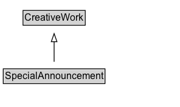

# SpecialAnnouncement

A SpecialAnnouncement combines a simple date-stamped textual information update
      with contextualized Web links and other structured data.  It represents an information update made by a
      locally-oriented organization, for example schools, pharmacies, healthcare providers,  community groups, police,
      local government.

For work in progress guidelines on Coronavirus-related markup see [this doc](https://docs.google.com/document/d/14ikaGCKxo50rRM7nvKSlbUpjyIk2WMQd3IkB1lItlrM/edit#).

The motivating scenario for SpecialAnnouncement is the [Coronavirus pandemic](https://en.wikipedia.org/wiki/2019%E2%80%9320_coronavirus_pandemic), and the initial vocabulary is oriented to this urgent situation. Schema.org
expect to improve the markup iteratively as it is deployed and as feedback emerges from use. In addition to our
usual [Github entry](https://github.com/schemaorg/schemaorg/issues/2490), feedback comments can also be provided in [this document](https://docs.google.com/document/d/1fpdFFxk8s87CWwACs53SGkYv3aafSxz_DTtOQxMrBJQ/edit#).

While this schema is designed to communicate urgent crisis-related information, it is not the same as an emergency warning technology like [CAP](https://en.wikipedia.org/wiki/Common_Alerting_Protocol), although there may be overlaps. The intent is to cover
the kinds of everyday practical information being posted to existing websites during an emergency situation.

Several kinds of information can be provided:

We encourage the provision of "name", "text", "datePosted", "expires" (if appropriate), "category" and
"url" as a simple baseline. It is important to provide a value for "category" where possible, most ideally as a well known
URL from Wikipedia or Wikidata. In the case of the 2019-2020 Coronavirus pandemic, this should be "https://en.wikipedia.org/w/index.php?title=2019-20\_coronavirus\_pandemic" or "https://www.wikidata.org/wiki/Q81068910".

For many of the possible properties, values can either be simple links or an inline description, depending on whether a summary is available. For a link, provide just the URL of the appropriate page as the property's value. For an inline description, use a [[WebContent]] type, and provide the url as a property of that, alongside at least a simple "[[text]]" summary of the page. It is
unlikely that a single SpecialAnnouncement will need all of the possible properties simultaneously.

We expect that in many cases the page referenced might contain more specialized structured data, e.g. contact info, [[openingHours]], [[Event]], [[FAQPage]] etc. By linking to those pages from a [[SpecialAnnouncement]] you can help make it clearer that the events are related to the situation (e.g. Coronavirus) indicated by the [[category]] property of the [[SpecialAnnouncement]].

Many [[SpecialAnnouncement]]s will relate to particular regions and to identifiable local organizations. Use [[spatialCoverage]] for the region, and [[announcementLocation]] to indicate specific [[LocalBusiness]]es and [[CivicStructure]]s. If the announcement affects both a particular region and a specific location (for example, a library closure that serves an entire region), use both [[spatialCoverage]] and [[announcementLocation]].

The [[about]] property can be used to indicate entities that are the focus of the announcement. We now recommend using [[about]] only
for representing non-location entities (e.g. a [[Course]] or a [[RadioStation]]). For places, use [[announcementLocation]] and [[spatialCoverage]]. Consumers of this markup should be aware that the initial design encouraged the use of [[about]] for locations too.

The basic content of [[SpecialAnnouncement]] is similar to that of an [RSS](https://en.wikipedia.org/wiki/RSS) or [Atom](https://en.wikipedia.org/wiki/Atom_(Web_standard)) feed. For publishers without such feeds, basic feed-like information can be shared by posting
[[SpecialAnnouncement]] updates in a page, e.g. using JSON-LD. For sites with Atom/RSS functionality, you can point to a feed
with the [[webFeed]] property. This can be a simple URL, or an inline [[DataFeed]] object, with [[encodingFormat]] providing
media type information, e.g. "application/rss+xml" or "application/atom+xml".

## Diagram

=== "SVG (interactive)"

    <!-- Generated by graphviz version 14.1.3 (20260303.0454)
     -->
    <!-- Pages: 1 -->
    <svg width="222pt" height="132pt"
     viewBox="0.00 0.00 222.00 132.00" xmlns="http://www.w3.org/2000/svg" xmlns:xlink="http://www.w3.org/1999/xlink">
    <g id="graph0" class="graph" transform="scale(1 1) rotate(0) translate(4 128)">
    <polygon fill="white" stroke="none" points="-4,4 -4,-128 217.75,-128 217.75,4 -4,4"/>
    <g id="clust3" class="cluster">
    <title>cluster_associated</title>
    </g>
    <!-- CreativeWork -->
    <g id="node1" class="node">
    <title>CreativeWork</title>
    <g id="a_node1"><a xlink:href="../CreativeWork" xlink:title="&lt;TABLE&gt;">
    <polygon fill="lightgray" stroke="none" points="25.38,-97.88 25.38,-114.12 100.12,-114.12 100.12,-97.88 25.38,-97.88"/>
    <text xml:space="preserve" text-anchor="start" x="26.38" y="-101.88" font-family="Arial" font-size="12.00">CreativeWork</text>
    <polygon fill="none" stroke="black" points="24.38,-96.88 24.38,-115.12 101.12,-115.12 101.12,-96.88 24.38,-96.88"/>
    </a>
    </g>
    </g>
    <!-- SpecialAnnouncement -->
    <g id="node2" class="node">
    <title>SpecialAnnouncement</title>
    <g id="a_node2"><a xlink:href="../SpecialAnnouncement" xlink:title="&lt;TABLE&gt;">
    <polygon fill="lightgray" stroke="none" points="1,-25.88 1,-42.12 124.5,-42.12 124.5,-25.88 1,-25.88"/>
    <text xml:space="preserve" text-anchor="start" x="2" y="-29.88" font-family="Arial" font-size="12.00">SpecialAnnouncement</text>
    <polygon fill="none" stroke="black" points="0,-24.88 0,-43.12 125.5,-43.12 125.5,-24.88 0,-24.88"/>
    </a>
    </g>
    </g>
    <!-- SpecialAnnouncement&#45;&gt;CreativeWork -->
    <g id="edge1" class="edge">
    <title>SpecialAnnouncement&#45;&gt;CreativeWork</title>
    <path fill="none" stroke="black" d="M62.75,-51.79C62.75,-59.25 62.75,-68.24 62.75,-76.69"/>
    <polygon fill="none" stroke="black" points="59.25,-76.54 62.75,-86.54 66.25,-76.54 59.25,-76.54"/>
    </g>
    <!-- Invis -->
    </g>
    </svg>

=== "PNG"

    

## Formalization for SpecialAnnouncement

| Property | Constraint |
|----------|------------|
| subClassOf | [CreativeWork](CreativeWork.md) |

