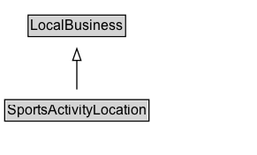

# SportsActivityLocation

A sports location, such as a playing field.

## Diagram

=== "SVG (interactive)"

    <!-- Generated by graphviz version 14.1.3 (20260303.0454)
     -->
    <!-- Pages: 1 -->
    <svg width="218pt" height="132pt"
     viewBox="0.00 0.00 218.00 132.00" xmlns="http://www.w3.org/2000/svg" xmlns:xlink="http://www.w3.org/1999/xlink">
    <g id="graph0" class="graph" transform="scale(1 1) rotate(0) translate(4 128)">
    <polygon fill="white" stroke="none" points="-4,4 -4,-128 214.25,-128 214.25,4 -4,4"/>
    <g id="clust3" class="cluster">
    <title>cluster_associated</title>
    </g>
    <!-- LocalBusiness -->
    <g id="node1" class="node">
    <title>LocalBusiness</title>
    <g id="a_node1"><a xlink:href="../LocalBusiness" xlink:title="&lt;TABLE&gt;">
    <polygon fill="lightgray" stroke="none" points="20.88,-97.88 20.88,-114.12 101.62,-114.12 101.62,-97.88 20.88,-97.88"/>
    <text xml:space="preserve" text-anchor="start" x="21.88" y="-101.88" font-family="Arial" font-size="12.00">LocalBusiness</text>
    <polygon fill="none" stroke="black" points="19.88,-96.88 19.88,-115.12 102.62,-115.12 102.62,-96.88 19.88,-96.88"/>
    </a>
    </g>
    </g>
    <!-- SportsActivityLocation -->
    <g id="node2" class="node">
    <title>SportsActivityLocation</title>
    <g id="a_node2"><a xlink:href="../SportsActivityLocation" xlink:title="&lt;TABLE&gt;">
    <polygon fill="lightgray" stroke="none" points="1,-25.88 1,-42.12 121.5,-42.12 121.5,-25.88 1,-25.88"/>
    <text xml:space="preserve" text-anchor="start" x="2" y="-29.88" font-family="Arial" font-size="12.00">SportsActivityLocation</text>
    <polygon fill="none" stroke="black" points="0,-24.88 0,-43.12 122.5,-43.12 122.5,-24.88 0,-24.88"/>
    </a>
    </g>
    </g>
    <!-- SportsActivityLocation&#45;&gt;LocalBusiness -->
    <g id="edge1" class="edge">
    <title>SportsActivityLocation&#45;&gt;LocalBusiness</title>
    <path fill="none" stroke="black" d="M61.25,-51.79C61.25,-59.25 61.25,-68.24 61.25,-76.69"/>
    <polygon fill="none" stroke="black" points="57.75,-76.54 61.25,-86.54 64.75,-76.54 57.75,-76.54"/>
    </g>
    <!-- Invis -->
    </g>
    </svg>

=== "PNG"

    

## Specializations of SportsActivityLocation

| Class | Description |
|-------|-------------|
| [Bowling Alley](BowlingAlley.md) | A bowling alley. |
| [Exercise Gym](ExerciseGym.md) | A gym. |
| [Golf Course](GolfCourse.md) | A golf course. |
| [Health Club](HealthClub.md) | A health club. |
| [Public Swimming Pool](PublicSwimmingPool.md) | A public swimming pool. |
| [Ski Resort](SkiResort.md) | A ski resort. |
| [Sports Club](SportsClub.md) | A sports club. |
| [Stadium Or Arena](StadiumOrArena.md) | A stadium. |
| [Tennis Complex](TennisComplex.md) | A tennis complex. |

## Formalization for SportsActivityLocation

| Property | Constraint |
|----------|------------|
| subClassOf | [LocalBusiness](LocalBusiness.md) |

