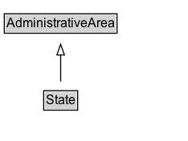

# State

A state or province of a country.

## Diagram

=== "SVG (interactive)"

    <!-- Generated by graphviz version 14.1.3 (20260303.0454)
     -->
    <!-- Pages: 1 -->
    <svg width="176pt" height="132pt"
     viewBox="0.00 0.00 176.00 132.00" xmlns="http://www.w3.org/2000/svg" xmlns:xlink="http://www.w3.org/1999/xlink">
    <g id="graph0" class="graph" transform="scale(1 1) rotate(0) translate(4 128)">
    <polygon fill="white" stroke="none" points="-4,4 -4,-128 171.62,-128 171.62,4 -4,4"/>
    <g id="clust3" class="cluster">
    <title>cluster_associated</title>
    </g>
    <!-- AdministrativeArea -->
    <g id="node1" class="node">
    <title>AdministrativeArea</title>
    <g id="a_node1"><a xlink:href="../AdministrativeArea" xlink:title="&lt;TABLE&gt;">
    <polygon fill="lightgray" stroke="none" points="1,-97.88 1,-114.12 104.25,-114.12 104.25,-97.88 1,-97.88"/>
    <text xml:space="preserve" text-anchor="start" x="2" y="-101.88" font-family="Arial" font-size="12.00">AdministrativeArea</text>
    <polygon fill="none" stroke="black" points="0,-96.88 0,-115.12 105.25,-115.12 105.25,-96.88 0,-96.88"/>
    </a>
    </g>
    </g>
    <!-- State -->
    <g id="node2" class="node">
    <title>State</title>
    <g id="a_node2"><a xlink:href="../State" xlink:title="&lt;TABLE&gt;">
    <polygon fill="lightgray" stroke="none" points="37.75,-25.88 37.75,-42.12 67.5,-42.12 67.5,-25.88 37.75,-25.88"/>
    <text xml:space="preserve" text-anchor="start" x="38.75" y="-29.88" font-family="Arial" font-size="12.00">State</text>
    <polygon fill="none" stroke="black" points="36.75,-24.88 36.75,-43.12 68.5,-43.12 68.5,-24.88 36.75,-24.88"/>
    </a>
    </g>
    </g>
    <!-- State&#45;&gt;AdministrativeArea -->
    <g id="edge1" class="edge">
    <title>State&#45;&gt;AdministrativeArea</title>
    <path fill="none" stroke="black" d="M52.62,-51.79C52.62,-59.25 52.62,-68.24 52.62,-76.69"/>
    <polygon fill="none" stroke="black" points="49.13,-76.54 52.63,-86.54 56.13,-76.54 49.13,-76.54"/>
    </g>
    <!-- Invis -->
    </g>
    </svg>

=== "PNG"

    

## Formalization for State

| Property | Constraint |
|----------|------------|
| subClassOf | [AdministrativeArea](AdministrativeArea.md) |

