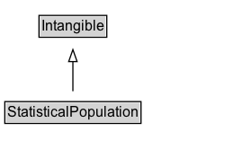

# StatisticalPopulation

A StatisticalPopulation is a set of instances of a certain given type that satisfy some set of constraints. The property [[populationType]] is used to specify the type. Any property that can be used on instances of that type can appear on the statistical population. For example, a [[StatisticalPopulation]] representing all [[Person]]s with a [[homeLocation]] of East Podunk California would be described by applying the appropriate [[homeLocation]] and [[populationType]] properties to a [[StatisticalPopulation]] item that stands for that set of people.
The properties [[numConstraints]] and [[constraintProperty]] are used to specify which of the populations properties are used to specify the population. Note that the sense of "population" used here is the general sense of a statistical
population, and does not imply that the population consists of people. For example, a [[populationType]] of [[Event]] or [[NewsArticle]] could be used. See also [[Observation]], where a [[populationType]] such as [[Person]] or [[Event]] can be indicated directly. In most cases it may be better to use [[StatisticalVariable]] instead of [[StatisticalPopulation]].

## Diagram

=== "SVG (interactive)"

    <!-- Generated by graphviz version 14.1.3 (20260303.0454)
     -->
    <!-- Pages: 1 -->
    <svg width="210pt" height="132pt"
     viewBox="0.00 0.00 210.00 132.00" xmlns="http://www.w3.org/2000/svg" xmlns:xlink="http://www.w3.org/1999/xlink">
    <g id="graph0" class="graph" transform="scale(1 1) rotate(0) translate(4 128)">
    <polygon fill="white" stroke="none" points="-4,4 -4,-128 205.75,-128 205.75,4 -4,4"/>
    <g id="clust3" class="cluster">
    <title>cluster_associated</title>
    </g>
    <!-- Intangible -->
    <g id="node1" class="node">
    <title>Intangible</title>
    <g id="a_node1"><a xlink:href="../Intangible" xlink:title="&lt;TABLE&gt;">
    <polygon fill="lightgray" stroke="none" points="29.5,-97.88 29.5,-114.12 84,-114.12 84,-97.88 29.5,-97.88"/>
    <text xml:space="preserve" text-anchor="start" x="30.5" y="-101.88" font-family="Arial" font-size="12.00">Intangible</text>
    <polygon fill="none" stroke="black" points="28.5,-96.88 28.5,-115.12 85,-115.12 85,-96.88 28.5,-96.88"/>
    </a>
    </g>
    </g>
    <!-- StatisticalPopulation -->
    <g id="node2" class="node">
    <title>StatisticalPopulation</title>
    <g id="a_node2"><a xlink:href="../StatisticalPopulation" xlink:title="&lt;TABLE&gt;">
    <polygon fill="lightgray" stroke="none" points="1,-25.88 1,-42.12 112.5,-42.12 112.5,-25.88 1,-25.88"/>
    <text xml:space="preserve" text-anchor="start" x="2" y="-29.88" font-family="Arial" font-size="12.00">StatisticalPopulation</text>
    <polygon fill="none" stroke="black" points="0,-24.88 0,-43.12 113.5,-43.12 113.5,-24.88 0,-24.88"/>
    </a>
    </g>
    </g>
    <!-- StatisticalPopulation&#45;&gt;Intangible -->
    <g id="edge1" class="edge">
    <title>StatisticalPopulation&#45;&gt;Intangible</title>
    <path fill="none" stroke="black" d="M56.75,-51.79C56.75,-59.25 56.75,-68.24 56.75,-76.69"/>
    <polygon fill="none" stroke="black" points="53.25,-76.54 56.75,-86.54 60.25,-76.54 53.25,-76.54"/>
    </g>
    <!-- Invis -->
    </g>
    </svg>

=== "PNG"

    

## Formalization for StatisticalPopulation

| Property | Constraint |
|----------|------------|
| subClassOf | [Intangible](Intangible.md) |

