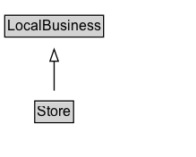

# Store

A retail good store.

## Diagram

=== "SVG (interactive)"

    <!-- Generated by graphviz version 14.1.3 (20260303.0454)
     -->
    <!-- Pages: 1 -->
    <svg width="164pt" height="132pt"
     viewBox="0.00 0.00 164.00 132.00" xmlns="http://www.w3.org/2000/svg" xmlns:xlink="http://www.w3.org/1999/xlink">
    <g id="graph0" class="graph" transform="scale(1 1) rotate(0) translate(4 128)">
    <polygon fill="white" stroke="none" points="-4,4 -4,-128 160.38,-128 160.38,4 -4,4"/>
    <g id="clust3" class="cluster">
    <title>cluster_associated</title>
    </g>
    <!-- LocalBusiness -->
    <g id="node1" class="node">
    <title>LocalBusiness</title>
    <g id="a_node1"><a xlink:href="../LocalBusiness" xlink:title="&lt;TABLE&gt;">
    <polygon fill="lightgray" stroke="none" points="1,-97.88 1,-114.12 81.75,-114.12 81.75,-97.88 1,-97.88"/>
    <text xml:space="preserve" text-anchor="start" x="2" y="-101.88" font-family="Arial" font-size="12.00">LocalBusiness</text>
    <polygon fill="none" stroke="black" points="0,-96.88 0,-115.12 82.75,-115.12 82.75,-96.88 0,-96.88"/>
    </a>
    </g>
    </g>
    <!-- Store -->
    <g id="node2" class="node">
    <title>Store</title>
    <g id="a_node2"><a xlink:href="../Store" xlink:title="&lt;TABLE&gt;">
    <polygon fill="lightgray" stroke="none" points="26.12,-25.88 26.12,-42.12 56.62,-42.12 56.62,-25.88 26.12,-25.88"/>
    <text xml:space="preserve" text-anchor="start" x="27.12" y="-29.88" font-family="Arial" font-size="12.00">Store</text>
    <polygon fill="none" stroke="black" points="25.12,-24.88 25.12,-43.12 57.62,-43.12 57.62,-24.88 25.12,-24.88"/>
    </a>
    </g>
    </g>
    <!-- Store&#45;&gt;LocalBusiness -->
    <g id="edge1" class="edge">
    <title>Store&#45;&gt;LocalBusiness</title>
    <path fill="none" stroke="black" d="M41.38,-51.79C41.38,-59.25 41.38,-68.24 41.38,-76.69"/>
    <polygon fill="none" stroke="black" points="37.88,-76.54 41.38,-86.54 44.88,-76.54 37.88,-76.54"/>
    </g>
    <!-- Invis -->
    </g>
    </svg>

=== "PNG"

    

## Specializations of Store

| Class | Description |
|-------|-------------|
| [Auto Parts Store](AutoPartsStore.md) | An auto parts store. |
| [Bike Store](BikeStore.md) | A bike store. |
| [Book Store](BookStore.md) | A bookstore. |
| [Clothing Store](ClothingStore.md) | A clothing store. |
| [Computer Store](ComputerStore.md) | A computer store. |
| [Convenience Store](ConvenienceStore.md) | A convenience store. |
| [Department Store](DepartmentStore.md) | A department store. |
| [Electronics Store](ElectronicsStore.md) | An electronics store. |
| [Florist](Florist.md) | A florist. |
| [Furniture Store](FurnitureStore.md) | A furniture store. |
| [Garden Store](GardenStore.md) | A garden store. |
| [Grocery Store](GroceryStore.md) | A grocery store. |
| [Hardware Store](HardwareStore.md) | A hardware store. |
| [Hobby Shop](HobbyShop.md) | A store that sells materials useful or necessary for various hobbies. |
| [Home Goods Store](HomeGoodsStore.md) | A home goods store. |
| [Jewelry Store](JewelryStore.md) | A jewelry store. |
| [Liquor Store](LiquorStore.md) | A shop that sells alcoholic drinks such as wine, beer, whisky and other spirits. |
| [Mens Clothing Store](MensClothingStore.md) | A men's clothing store. |
| [Mobile Phone Store](MobilePhoneStore.md) | A store that sells mobile phones and related accessories. |
| [Movie Rental Store](MovieRentalStore.md) | A movie rental store. |
| [Music Store](MusicStore.md) | A music store. |
| [Office Equipment Store](OfficeEquipmentStore.md) | An office equipment store. |
| [Outlet Store](OutletStore.md) | An outlet store. |
| [Pawn Shop](PawnShop.md) | A shop that will buy, or lend money against the security of, personal possessions. |
| [Pet Store](PetStore.md) | A pet store. |
| [Shoe Store](ShoeStore.md) | A shoe store. |
| [Sporting Goods Store](SportingGoodsStore.md) | A sporting goods store. |
| [Tire Shop](TireShop.md) | A tire shop. |
| [Toy Store](ToyStore.md) | A toy store. |
| [Wholesale Store](WholesaleStore.md) | A wholesale store. |

## Formalization for Store

| Property | Constraint |
|----------|------------|
| subClassOf | [LocalBusiness](LocalBusiness.md) |

