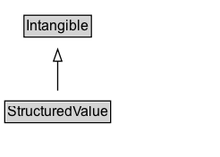

# StructuredValue

Structured values are used when the value of a property has a more complex structure than simply being a textual value or a reference to another thing.

## Diagram

=== "SVG (interactive)"

    <!-- Generated by graphviz version 14.1.3 (20260303.0454)
     -->
    <!-- Pages: 1 -->
    <svg width="184pt" height="132pt"
     viewBox="0.00 0.00 184.00 132.00" xmlns="http://www.w3.org/2000/svg" xmlns:xlink="http://www.w3.org/1999/xlink">
    <g id="graph0" class="graph" transform="scale(1 1) rotate(0) translate(4 128)">
    <polygon fill="white" stroke="none" points="-4,4 -4,-128 180.38,-128 180.38,4 -4,4"/>
    <g id="clust3" class="cluster">
    <title>cluster_associated</title>
    </g>
    <!-- Intangible -->
    <g id="node1" class="node">
    <title>Intangible</title>
    <g id="a_node1"><a xlink:href="../Intangible" xlink:title="&lt;TABLE&gt;">
    <polygon fill="lightgray" stroke="none" points="17.12,-97.88 17.12,-114.12 71.62,-114.12 71.62,-97.88 17.12,-97.88"/>
    <text xml:space="preserve" text-anchor="start" x="18.12" y="-101.88" font-family="Arial" font-size="12.00">Intangible</text>
    <polygon fill="none" stroke="black" points="16.12,-96.88 16.12,-115.12 72.62,-115.12 72.62,-96.88 16.12,-96.88"/>
    </a>
    </g>
    </g>
    <!-- StructuredValue -->
    <g id="node2" class="node">
    <title>StructuredValue</title>
    <g id="a_node2"><a xlink:href="../StructuredValue" xlink:title="&lt;TABLE&gt;">
    <polygon fill="lightgray" stroke="none" points="1,-25.88 1,-42.12 87.75,-42.12 87.75,-25.88 1,-25.88"/>
    <text xml:space="preserve" text-anchor="start" x="2" y="-29.88" font-family="Arial" font-size="12.00">StructuredValue</text>
    <polygon fill="none" stroke="black" points="0,-24.88 0,-43.12 88.75,-43.12 88.75,-24.88 0,-24.88"/>
    </a>
    </g>
    </g>
    <!-- StructuredValue&#45;&gt;Intangible -->
    <g id="edge1" class="edge">
    <title>StructuredValue&#45;&gt;Intangible</title>
    <path fill="none" stroke="black" d="M44.38,-51.79C44.38,-59.25 44.38,-68.24 44.38,-76.69"/>
    <polygon fill="none" stroke="black" points="40.88,-76.54 44.38,-86.54 47.88,-76.54 40.88,-76.54"/>
    </g>
    <!-- Invis -->
    </g>
    </svg>

=== "PNG"

    

## Specializations of StructuredValue

| Class | Description |
|-------|-------------|
| [Cdcpmd Record](CDCPMDRecord.md) | A CDCPMDRecord is a data structure representing a record in a CDC tabular data format
      used for hospital data reporting. See [documentation](/docs/cdc-covid.html) for details, and the linked CDC materials for authoritative
      definitions used as the source here.
       |
| [Compound Price Specification](CompoundPriceSpecification.md) | A compound price specification is one that bundles multiple prices that all apply in combination for different dimensions of consumption. Use the name property of the attached unit price specification for indicating the dimension of a price component (e.g. "electricity" or "final cleaning"). |
| [Contact Point](ContactPoint.md) | A contact point&#x2014;for example, a Customer Complaints department. |
| [Dated Money Specification](DatedMoneySpecification.md) | A DatedMoneySpecification represents monetary values with optional start and end dates. For example, this could represent an employee's salary over a specific period of time. __Note:__ This type has been superseded by [[MonetaryAmount]], use of that type is recommended. |
| [Defined Region](DefinedRegion.md) | A DefinedRegion is a geographic area defined by potentially arbitrary (rather than political, administrative or natural geographical) criteria. Properties are provided for defining a region by reference to sets of postal codes.

Examples: a delivery destination when shopping. Region where regional pricing is configured.

Requirement 1:
Country: US
States: "NY", "CA"

Requirement 2:
Country: US
PostalCode Set: { [94000-94585], [97000, 97999], [13000, 13599]}
{ [12345, 12345], [78945, 78945], }
Region = state, canton, prefecture, autonomous community...
 |
| [Delivery Charge Specification](DeliveryChargeSpecification.md) | The price for the delivery of an offer using a particular delivery method. |
| [Engine Specification](EngineSpecification.md) | Information about the engine of the vehicle. A vehicle can have multiple engines represented by multiple engine specification entities. |
| [Error](Error.md) | Representation of an Error. |
| [Exchange Rate Specification](ExchangeRateSpecification.md) | A structured value representing exchange rate. |
| [Geo Circle](GeoCircle.md) | A GeoCircle is a GeoShape representing a circular geographic area. As it is a GeoShape
          it provides the simple textual property 'circle', but also allows the combination of postalCode alongside geoRadius.
          The center of the circle can be indicated via the 'geoMidpoint' property, or more approximately using 'address', 'postalCode'.
        |
| [Geo Coordinates](GeoCoordinates.md) | The geographic coordinates of a place or event. |
| [Geo Shape](GeoShape.md) | The geographic shape of a place. A GeoShape can be described using several properties whose values are based on latitude/longitude pairs. Either whitespace or commas can be used to separate latitude and longitude; whitespace should be used when writing a list of several such points. |
| [Instantaneous Event](InstantaneousEvent.md) | An event with no duration, like for instance a computer log entry. |
| [Interaction Counter](InteractionCounter.md) | A summary of how users have interacted with this CreativeWork. In most cases, authors will use a subtype to specify the specific type of interaction. |
| [Location Feature Specification](LocationFeatureSpecification.md) | Specifies a location feature by providing a structured value representing a feature of an accommodation as a property-value pair of varying degrees of formality. |
| [Monetary Amount](MonetaryAmount.md) | A monetary value or range. This type can be used to describe an amount of money such as $50 USD, or a range as in describing a bank account being suitable for a balance between £1,000 and £1,000,000 GBP, or the value of a salary, etc. It is recommended to use [[PriceSpecification]] Types to describe the price of an Offer, Invoice, etc. |
| [Monetary Amount Distribution](MonetaryAmountDistribution.md) | A statistical distribution of monetary amounts. |
| [Nutrition Information](NutritionInformation.md) | Nutritional information about the recipe. |
| [Observation](Observation.md) | Instances of the class [[Observation]] are used to specify observations about an entity at a particular time. The principal properties of an [[Observation]] are [[observationAbout]], [[measuredProperty]], [[statType]], [[value] and [[observationDate]]  and [[measuredProperty]]. Some but not all Observations represent a [[QuantitativeValue]]. Quantitative observations can be about a [[StatisticalVariable]], which is an abstract specification about which we can make observations that are grounded at a particular location and time.

Observations can also encode a subset of simple RDF-like statements (its observationAbout, a StatisticalVariable, defining the measuredPoperty; its observationAbout property indicating the entity the statement is about, and [[value]] )

In the context of a quantitative knowledge graph, typical properties could include [[measuredProperty]], [[observationAbout]], [[observationDate]], [[value]], [[unitCode]], [[unitText]], [[measurementMethod]].
     |
| [Offer Shipping Details](OfferShippingDetails.md) | OfferShippingDetails represents information about shipping destinations.

Multiple of these entities can be used to represent different shipping rates for different destinations:

One entity for Alaska/Hawaii. A different one for continental US. A different one for all France.

Multiple of these entities can be used to represent different shipping costs and delivery times.

Two entities that are identical but differ in rate and time:

E.g. Cheaper and slower: $5 in 5-7 days
or Fast and expensive: $15 in 1-2 days. |
| [Opening Hours Specification](OpeningHoursSpecification.md) | A structured value providing information about the opening hours of a place or a certain service inside a place.\n\n
The place is __open__ if the [[opens]] property is specified, and __closed__ otherwise.\n\nIf the value for the [[closes]] property is less than the value for the [[opens]] property then the hour range is assumed to span over the next day.
       |
| [Order Item](OrderItem.md) | An order item is a line of an order. It includes the quantity and shipping details of a bought offer. |
| [Ownership Info](OwnershipInfo.md) | A structured value providing information about when a certain organization or person owned a certain product. |
| [Payment Charge Specification](PaymentChargeSpecification.md) | The costs of settling the payment using a particular payment method. |
| [Postal Address](PostalAddress.md) | The mailing address. |
| [Postal Code Range Specification](PostalCodeRangeSpecification.md) | Indicates a range of postal codes, usually defined as the set of valid codes between [[postalCodeBegin]] and [[postalCodeEnd]], inclusively. |
| [Price Specification](PriceSpecification.md) | A structured value representing a price or price range. Typically, only the subclasses of this type are used for markup. It is recommended to use [[MonetaryAmount]] to describe independent amounts of money such as a salary, credit card limits, etc. |
| [Property Value](PropertyValue.md) | A property-value pair, e.g. representing a feature of a product or place. Use the 'name' property for the name of the property. If there is an additional human-readable version of the value, put that into the 'description' property.\n\n Always use specific schema.org properties when a) they exist and b) you can populate them. Using PropertyValue as a substitute will typically not trigger the same effect as using the original, specific property.
     |
| [Quantitative Value](QuantitativeValue.md) |  A point value or interval for product characteristics and other purposes. |
| [Quantitative Value Distribution](QuantitativeValueDistribution.md) | A statistical distribution of values. |
| [Repayment Specification](RepaymentSpecification.md) | A structured value representing repayment. |
| [Service Period](ServicePeriod.md) | ServicePeriod represents a duration with some constraints about cutoff time and business days. This is used e.g. in shipping for handling times or transit time. |
| [Shipping Conditions](ShippingConditions.md) | ShippingConditions represent a set of constraints and information about the conditions of shipping a product. Such conditions may apply to only a subset of the products being shipped, depending on aspects of the product like weight, size, price, destination, and others. All the specified conditions must be met for this ShippingConditions to apply. |
| [Shipping Delivery Time](ShippingDeliveryTime.md) | ShippingDeliveryTime provides various pieces of information about delivery times for shipping. |
| [Shipping Rate Settings](ShippingRateSettings.md) | A ShippingRateSettings represents re-usable pieces of shipping information. It is designed for publication on an URL that may be referenced via the [[shippingSettingsLink]] property of an [[OfferShippingDetails]]. Several occurrences can be published, distinguished and matched (i.e. identified/referenced) by their different values for [[shippingLabel]]. |
| [Shipping Service](ShippingService.md) | ShippingService represents the criteria used to determine if and how an offer could be shipped to a customer. |
| [Type And Quantity Node](TypeAndQuantityNode.md) | A structured value indicating the quantity, unit of measurement, and business function of goods included in a bundle offer. |
| [Unit Price Specification](UnitPriceSpecification.md) | The price asked for a given offer by the respective organization or person. |
| [Warranty Promise](WarrantyPromise.md) | A structured value representing the duration and scope of services that will be provided to a customer free of charge in case of a defect or malfunction of a product. |

## Formalization for StructuredValue

| Property | Constraint |
|----------|------------|
| subClassOf | [Intangible](Intangible.md) |

