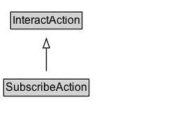

# SubscribeAction

The act of forming a personal connection with someone/something (object) unidirectionally/asymmetrically to get updates pushed to.\n\nRelated actions:\n\n* [[FollowAction]]: Unlike FollowAction, SubscribeAction implies that the subscriber acts as a passive agent being constantly/actively pushed for updates.\n* [[RegisterAction]]: Unlike RegisterAction, SubscribeAction implies that the agent is interested in continuing receiving updates from the object.\n* [[JoinAction]]: Unlike JoinAction, SubscribeAction implies that the agent is interested in continuing receiving updates from the object.

## Diagram

=== "SVG (interactive)"

    <!-- Generated by graphviz version 14.1.3 (20260303.0454)
     -->
    <!-- Pages: 1 -->
    <svg width="188pt" height="132pt"
     viewBox="0.00 0.00 188.00 132.00" xmlns="http://www.w3.org/2000/svg" xmlns:xlink="http://www.w3.org/1999/xlink">
    <g id="graph0" class="graph" transform="scale(1 1) rotate(0) translate(4 128)">
    <polygon fill="white" stroke="none" points="-4,4 -4,-128 183.88,-128 183.88,4 -4,4"/>
    <g id="clust3" class="cluster">
    <title>cluster_associated</title>
    </g>
    <!-- InteractAction -->
    <g id="node1" class="node">
    <title>InteractAction</title>
    <g id="a_node1"><a xlink:href="../InteractAction" xlink:title="&lt;TABLE&gt;">
    <polygon fill="lightgray" stroke="none" points="8.5,-97.88 8.5,-114.12 83.25,-114.12 83.25,-97.88 8.5,-97.88"/>
    <text xml:space="preserve" text-anchor="start" x="9.5" y="-101.88" font-family="Arial" font-size="12.00">InteractAction</text>
    <polygon fill="none" stroke="black" points="7.5,-96.88 7.5,-115.12 84.25,-115.12 84.25,-96.88 7.5,-96.88"/>
    </a>
    </g>
    </g>
    <!-- SubscribeAction -->
    <g id="node2" class="node">
    <title>SubscribeAction</title>
    <g id="a_node2"><a xlink:href="../SubscribeAction" xlink:title="&lt;TABLE&gt;">
    <polygon fill="lightgray" stroke="none" points="1,-25.88 1,-42.12 90.75,-42.12 90.75,-25.88 1,-25.88"/>
    <text xml:space="preserve" text-anchor="start" x="2" y="-29.88" font-family="Arial" font-size="12.00">SubscribeAction</text>
    <polygon fill="none" stroke="black" points="0,-24.88 0,-43.12 91.75,-43.12 91.75,-24.88 0,-24.88"/>
    </a>
    </g>
    </g>
    <!-- SubscribeAction&#45;&gt;InteractAction -->
    <g id="edge1" class="edge">
    <title>SubscribeAction&#45;&gt;InteractAction</title>
    <path fill="none" stroke="black" d="M45.88,-51.79C45.88,-59.25 45.88,-68.24 45.88,-76.69"/>
    <polygon fill="none" stroke="black" points="42.38,-76.54 45.88,-86.54 49.38,-76.54 42.38,-76.54"/>
    </g>
    <!-- Invis -->
    </g>
    </svg>

=== "PNG"

    

## Formalization for SubscribeAction

| Property | Constraint |
|----------|------------|
| subClassOf | [InteractAction](InteractAction.md) |

