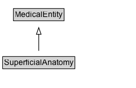

# SuperficialAnatomy

Anatomical features that can be observed by sight (without dissection), including the form and proportions of the human body as well as surface landmarks that correspond to deeper subcutaneous structures. Superficial anatomy plays an important role in sports medicine, phlebotomy, and other medical specialties as underlying anatomical structures can be identified through surface palpation. For example, during back surgery, superficial anatomy can be used to palpate and count vertebrae to find the site of incision. Or in phlebotomy, superficial anatomy can be used to locate an underlying vein; for example, the median cubital vein can be located by palpating the borders of the cubital fossa (such as the epicondyles of the humerus) and then looking for the superficial signs of the vein, such as size, prominence, ability to refill after depression, and feel of surrounding tissue support. As another example, in a subluxation (dislocation) of the glenohumeral joint, the bony structure becomes pronounced with the deltoid muscle failing to cover the glenohumeral joint allowing the edges of the scapula to be superficially visible. Here, the superficial anatomy is the visible edges of the scapula, implying the underlying dislocation of the joint (the related anatomical structure).

## Diagram

=== "SVG (interactive)"

    <!-- Generated by graphviz version 14.1.3 (20260303.0454)
     -->
    <!-- Pages: 1 -->
    <svg width="204pt" height="132pt"
     viewBox="0.00 0.00 204.00 132.00" xmlns="http://www.w3.org/2000/svg" xmlns:xlink="http://www.w3.org/1999/xlink">
    <g id="graph0" class="graph" transform="scale(1 1) rotate(0) translate(4 128)">
    <polygon fill="white" stroke="none" points="-4,4 -4,-128 200.12,-128 200.12,4 -4,4"/>
    <g id="clust3" class="cluster">
    <title>cluster_associated</title>
    </g>
    <!-- MedicalEntity -->
    <g id="node1" class="node">
    <title>MedicalEntity</title>
    <g id="a_node1"><a xlink:href="../MedicalEntity" xlink:title="&lt;TABLE&gt;">
    <polygon fill="lightgray" stroke="none" points="17.12,-97.88 17.12,-114.12 91.12,-114.12 91.12,-97.88 17.12,-97.88"/>
    <text xml:space="preserve" text-anchor="start" x="18.12" y="-101.88" font-family="Arial" font-size="12.00">MedicalEntity</text>
    <polygon fill="none" stroke="black" points="16.12,-96.88 16.12,-115.12 92.12,-115.12 92.12,-96.88 16.12,-96.88"/>
    </a>
    </g>
    </g>
    <!-- SuperficialAnatomy -->
    <g id="node2" class="node">
    <title>SuperficialAnatomy</title>
    <g id="a_node2"><a xlink:href="../SuperficialAnatomy" xlink:title="&lt;TABLE&gt;">
    <polygon fill="lightgray" stroke="none" points="1,-25.88 1,-42.12 107.25,-42.12 107.25,-25.88 1,-25.88"/>
    <text xml:space="preserve" text-anchor="start" x="2" y="-29.88" font-family="Arial" font-size="12.00">SuperficialAnatomy</text>
    <polygon fill="none" stroke="black" points="0,-24.88 0,-43.12 108.25,-43.12 108.25,-24.88 0,-24.88"/>
    </a>
    </g>
    </g>
    <!-- SuperficialAnatomy&#45;&gt;MedicalEntity -->
    <g id="edge1" class="edge">
    <title>SuperficialAnatomy&#45;&gt;MedicalEntity</title>
    <path fill="none" stroke="black" d="M54.12,-51.79C54.12,-59.25 54.12,-68.24 54.12,-76.69"/>
    <polygon fill="none" stroke="black" points="50.63,-76.54 54.13,-86.54 57.63,-76.54 50.63,-76.54"/>
    </g>
    <!-- Invis -->
    </g>
    </svg>

=== "PNG"

    

## Formalization for SuperficialAnatomy

| Property | Constraint |
|----------|------------|
| subClassOf | [MedicalEntity](MedicalEntity.md) |

