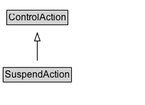

# SuspendAction

The act of momentarily pausing a device or application (e.g. pause music playback or pause a timer).

## Diagram

=== "SVG (interactive)"

    <!-- Generated by graphviz version 14.1.3 (20260303.0454)
     -->
    <!-- Pages: 1 -->
    <svg width="182pt" height="132pt"
     viewBox="0.00 0.00 182.00 132.00" xmlns="http://www.w3.org/2000/svg" xmlns:xlink="http://www.w3.org/1999/xlink">
    <g id="graph0" class="graph" transform="scale(1 1) rotate(0) translate(4 128)">
    <polygon fill="white" stroke="none" points="-4,4 -4,-128 177.88,-128 177.88,4 -4,4"/>
    <g id="clust3" class="cluster">
    <title>cluster_associated</title>
    </g>
    <!-- ControlAction -->
    <g id="node1" class="node">
    <title>ControlAction</title>
    <g id="a_node1"><a xlink:href="../ControlAction" xlink:title="&lt;TABLE&gt;">
    <polygon fill="lightgray" stroke="none" points="5.5,-97.88 5.5,-114.12 80.25,-114.12 80.25,-97.88 5.5,-97.88"/>
    <text xml:space="preserve" text-anchor="start" x="6.5" y="-101.88" font-family="Arial" font-size="12.00">ControlAction</text>
    <polygon fill="none" stroke="black" points="4.5,-96.88 4.5,-115.12 81.25,-115.12 81.25,-96.88 4.5,-96.88"/>
    </a>
    </g>
    </g>
    <!-- SuspendAction -->
    <g id="node2" class="node">
    <title>SuspendAction</title>
    <g id="a_node2"><a xlink:href="../SuspendAction" xlink:title="&lt;TABLE&gt;">
    <polygon fill="lightgray" stroke="none" points="1,-25.88 1,-42.12 84.75,-42.12 84.75,-25.88 1,-25.88"/>
    <text xml:space="preserve" text-anchor="start" x="2" y="-29.88" font-family="Arial" font-size="12.00">SuspendAction</text>
    <polygon fill="none" stroke="black" points="0,-24.88 0,-43.12 85.75,-43.12 85.75,-24.88 0,-24.88"/>
    </a>
    </g>
    </g>
    <!-- SuspendAction&#45;&gt;ControlAction -->
    <g id="edge1" class="edge">
    <title>SuspendAction&#45;&gt;ControlAction</title>
    <path fill="none" stroke="black" d="M42.88,-51.79C42.88,-59.25 42.88,-68.24 42.88,-76.69"/>
    <polygon fill="none" stroke="black" points="39.38,-76.54 42.88,-86.54 46.38,-76.54 39.38,-76.54"/>
    </g>
    <!-- Invis -->
    </g>
    </svg>

=== "PNG"

    

## Formalization for SuspendAction

| Property | Constraint |
|----------|------------|
| subClassOf | [ControlAction](ControlAction.md) |

