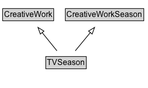

# TVSeason

Season dedicated to TV broadcast and associated online delivery.

## Diagram

=== "SVG (interactive)"

    <!-- Generated by graphviz version 14.1.3 (20260303.0454)
     -->
    <!-- Pages: 1 -->
    <svg width="222pt" height="132pt"
     viewBox="0.00 0.00 222.00 132.00" xmlns="http://www.w3.org/2000/svg" xmlns:xlink="http://www.w3.org/1999/xlink">
    <g id="graph0" class="graph" transform="scale(1 1) rotate(0) translate(4 128)">
    <polygon fill="white" stroke="none" points="-4,4 -4,-128 218.38,-128 218.38,4 -4,4"/>
    <g id="clust3" class="cluster">
    <title>cluster_associated</title>
    </g>
    <!-- CreativeWork -->
    <g id="node1" class="node">
    <title>CreativeWork</title>
    <g id="a_node1"><a xlink:href="../CreativeWork" xlink:title="&lt;TABLE&gt;">
    <polygon fill="lightgray" stroke="none" points="1,-97.88 1,-114.12 75.75,-114.12 75.75,-97.88 1,-97.88"/>
    <text xml:space="preserve" text-anchor="start" x="2" y="-101.88" font-family="Arial" font-size="12.00">CreativeWork</text>
    <polygon fill="none" stroke="black" points="0,-96.88 0,-115.12 76.75,-115.12 76.75,-96.88 0,-96.88"/>
    </a>
    </g>
    </g>
    <!-- CreativeWorkSeason -->
    <g id="node2" class="node">
    <title>CreativeWorkSeason</title>
    <g id="a_node2"><a xlink:href="../CreativeWorkSeason" xlink:title="&lt;TABLE&gt;">
    <polygon fill="lightgray" stroke="none" points="95.38,-97.88 95.38,-114.12 211.38,-114.12 211.38,-97.88 95.38,-97.88"/>
    <text xml:space="preserve" text-anchor="start" x="96.38" y="-101.88" font-family="Arial" font-size="12.00">CreativeWorkSeason</text>
    <polygon fill="none" stroke="black" points="94.38,-96.88 94.38,-115.12 212.38,-115.12 212.38,-96.88 94.38,-96.88"/>
    </a>
    </g>
    </g>
    <!-- TVSeason -->
    <g id="node3" class="node">
    <title>TVSeason</title>
    <g id="a_node3"><a xlink:href="../TVSeason" xlink:title="&lt;TABLE&gt;">
    <polygon fill="lightgray" stroke="none" points="65.88,-25.88 65.88,-42.12 124.88,-42.12 124.88,-25.88 65.88,-25.88"/>
    <text xml:space="preserve" text-anchor="start" x="66.88" y="-29.88" font-family="Arial" font-size="12.00">TVSeason</text>
    <polygon fill="none" stroke="black" points="64.88,-24.88 64.88,-43.12 125.88,-43.12 125.88,-24.88 64.88,-24.88"/>
    </a>
    </g>
    </g>
    <!-- TVSeason&#45;&gt;CreativeWork -->
    <g id="edge1" class="edge">
    <title>TVSeason&#45;&gt;CreativeWork</title>
    <path fill="none" stroke="black" d="M81.7,-51.79C75,-60.02 66.78,-70.11 59.31,-79.29"/>
    <polygon fill="none" stroke="black" points="56.73,-76.92 53.13,-86.88 62.16,-81.34 56.73,-76.92"/>
    </g>
    <!-- TVSeason&#45;&gt;CreativeWorkSeason -->
    <g id="edge2" class="edge">
    <title>TVSeason&#45;&gt;CreativeWorkSeason</title>
    <path fill="none" stroke="black" d="M109.29,-51.79C116.11,-60.02 124.47,-70.11 132.07,-79.29"/>
    <polygon fill="none" stroke="black" points="129.29,-81.42 138.37,-86.89 134.68,-76.96 129.29,-81.42"/>
    </g>
    <!-- Invis -->
    </g>
    </svg>

=== "PNG"

    

## Formalization for TVSeason

| Property | Constraint |
|----------|------------|
| subClassOf | [CreativeWork](CreativeWork.md) |
| subClassOf | [CreativeWorkSeason](CreativeWorkSeason.md) |

