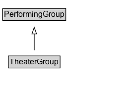

# TheaterGroup

A theater group or company, for example, the Royal Shakespeare Company or Druid Theatre.

## Diagram

=== "SVG (interactive)"

    <!-- Generated by graphviz version 14.1.3 (20260303.0454)
     -->
    <!-- Pages: 1 -->
    <svg width="183pt" height="132pt"
     viewBox="0.00 0.00 183.00 132.00" xmlns="http://www.w3.org/2000/svg" xmlns:xlink="http://www.w3.org/1999/xlink">
    <g id="graph0" class="graph" transform="scale(1 1) rotate(0) translate(4 128)">
    <polygon fill="white" stroke="none" points="-4,4 -4,-128 178.75,-128 178.75,4 -4,4"/>
    <g id="clust3" class="cluster">
    <title>cluster_associated</title>
    </g>
    <!-- PerformingGroup -->
    <g id="node1" class="node">
    <title>PerformingGroup</title>
    <g id="a_node1"><a xlink:href="../PerformingGroup" xlink:title="&lt;TABLE&gt;">
    <polygon fill="lightgray" stroke="none" points="1,-97.88 1,-114.12 94.5,-114.12 94.5,-97.88 1,-97.88"/>
    <text xml:space="preserve" text-anchor="start" x="2" y="-101.88" font-family="Arial" font-size="12.00">PerformingGroup</text>
    <polygon fill="none" stroke="black" points="0,-96.88 0,-115.12 95.5,-115.12 95.5,-96.88 0,-96.88"/>
    </a>
    </g>
    </g>
    <!-- TheaterGroup -->
    <g id="node2" class="node">
    <title>TheaterGroup</title>
    <g id="a_node2"><a xlink:href="../TheaterGroup" xlink:title="&lt;TABLE&gt;">
    <polygon fill="lightgray" stroke="none" points="9.62,-25.88 9.62,-42.12 85.88,-42.12 85.88,-25.88 9.62,-25.88"/>
    <text xml:space="preserve" text-anchor="start" x="10.62" y="-29.88" font-family="Arial" font-size="12.00">TheaterGroup</text>
    <polygon fill="none" stroke="black" points="8.62,-24.88 8.62,-43.12 86.88,-43.12 86.88,-24.88 8.62,-24.88"/>
    </a>
    </g>
    </g>
    <!-- TheaterGroup&#45;&gt;PerformingGroup -->
    <g id="edge1" class="edge">
    <title>TheaterGroup&#45;&gt;PerformingGroup</title>
    <path fill="none" stroke="black" d="M47.75,-51.79C47.75,-59.25 47.75,-68.24 47.75,-76.69"/>
    <polygon fill="none" stroke="black" points="44.25,-76.54 47.75,-86.54 51.25,-76.54 44.25,-76.54"/>
    </g>
    <!-- Invis -->
    </g>
    </svg>

=== "PNG"

    

## Formalization for TheaterGroup

| Property | Constraint |
|----------|------------|
| subClassOf | [PerformingGroup](PerformingGroup.md) |

