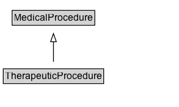

# TherapeuticProcedure

A medical procedure intended primarily for therapeutic purposes, aimed at improving a health condition.

## Diagram

=== "SVG (interactive)"

    <!-- Generated by graphviz version 14.1.3 (20260303.0454)
     -->
    <!-- Pages: 1 -->
    <svg width="220pt" height="132pt"
     viewBox="0.00 0.00 220.00 132.00" xmlns="http://www.w3.org/2000/svg" xmlns:xlink="http://www.w3.org/1999/xlink">
    <g id="graph0" class="graph" transform="scale(1 1) rotate(0) translate(4 128)">
    <polygon fill="white" stroke="none" points="-4,4 -4,-128 215.62,-128 215.62,4 -4,4"/>
    <g id="clust3" class="cluster">
    <title>cluster_associated</title>
    </g>
    <!-- MedicalProcedure -->
    <g id="node1" class="node">
    <title>MedicalProcedure</title>
    <g id="a_node1"><a xlink:href="../MedicalProcedure" xlink:title="&lt;TABLE&gt;">
    <polygon fill="lightgray" stroke="none" points="11.88,-97.88 11.88,-114.12 111.38,-114.12 111.38,-97.88 11.88,-97.88"/>
    <text xml:space="preserve" text-anchor="start" x="12.88" y="-101.88" font-family="Arial" font-size="12.00">MedicalProcedure</text>
    <polygon fill="none" stroke="black" points="10.88,-96.88 10.88,-115.12 112.38,-115.12 112.38,-96.88 10.88,-96.88"/>
    </a>
    </g>
    </g>
    <!-- TherapeuticProcedure -->
    <g id="node2" class="node">
    <title>TherapeuticProcedure</title>
    <g id="a_node2"><a xlink:href="../TherapeuticProcedure" xlink:title="&lt;TABLE&gt;">
    <polygon fill="lightgray" stroke="none" points="1,-25.88 1,-42.12 122.25,-42.12 122.25,-25.88 1,-25.88"/>
    <text xml:space="preserve" text-anchor="start" x="2" y="-29.88" font-family="Arial" font-size="12.00">TherapeuticProcedure</text>
    <polygon fill="none" stroke="black" points="0,-24.88 0,-43.12 123.25,-43.12 123.25,-24.88 0,-24.88"/>
    </a>
    </g>
    </g>
    <!-- TherapeuticProcedure&#45;&gt;MedicalProcedure -->
    <g id="edge1" class="edge">
    <title>TherapeuticProcedure&#45;&gt;MedicalProcedure</title>
    <path fill="none" stroke="black" d="M61.62,-51.79C61.62,-59.25 61.62,-68.24 61.62,-76.69"/>
    <polygon fill="none" stroke="black" points="58.13,-76.54 61.63,-86.54 65.13,-76.54 58.13,-76.54"/>
    </g>
    <!-- Invis -->
    </g>
    </svg>

=== "PNG"

    

## Specializations of TherapeuticProcedure

| Class | Description |
|-------|-------------|
| [Medical Therapy](MedicalTherapy.md) | Any medical intervention designed to prevent, treat, and cure human diseases and medical conditions, including both curative and palliative therapies. Medical therapies are typically processes of care relying upon pharmacotherapy, behavioral therapy, supportive therapy (with fluid or nutrition for example), or detoxification (e.g. hemodialysis) aimed at improving or preventing a health condition. |
| [Occupational Therapy](OccupationalTherapy.md) | A treatment of people with physical, emotional, or social problems, using purposeful activity to help them overcome or learn to deal with their problems. |
| [Palliative Procedure](PalliativeProcedure.md) | A medical procedure intended primarily for palliative purposes, aimed at relieving the symptoms of an underlying health condition. |
| [Physical Therapy](PhysicalTherapy.md) | A process of progressive physical care and rehabilitation aimed at improving a health condition. |
| [Psychological Treatment](PsychologicalTreatment.md) | A process of care relying upon counseling, dialogue and communication  aimed at improving a mental health condition without use of drugs. |
| [Radiation Therapy](RadiationTherapy.md) | A process of care using radiation aimed at improving a health condition. |

## Formalization for TherapeuticProcedure

| Property | Constraint |
|----------|------------|
| subClassOf | [MedicalProcedure](MedicalProcedure.md) |

