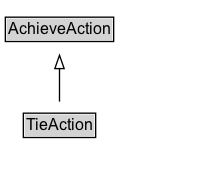

# TieAction

The act of reaching a draw in a competitive activity.

## Diagram

=== "SVG (interactive)"

    <!-- Generated by graphviz version 14.1.3 (20260303.0454)
     -->
    <!-- Pages: 1 -->
    <svg width="164pt" height="132pt"
     viewBox="0.00 0.00 164.00 132.00" xmlns="http://www.w3.org/2000/svg" xmlns:xlink="http://www.w3.org/1999/xlink">
    <g id="graph0" class="graph" transform="scale(1 1) rotate(0) translate(4 128)">
    <polygon fill="white" stroke="none" points="-4,4 -4,-128 159.62,-128 159.62,4 -4,4"/>
    <g id="clust3" class="cluster">
    <title>cluster_associated</title>
    </g>
    <!-- AchieveAction -->
    <g id="node1" class="node">
    <title>AchieveAction</title>
    <g id="a_node1"><a xlink:href="../AchieveAction" xlink:title="&lt;TABLE&gt;">
    <polygon fill="lightgray" stroke="none" points="1,-97.88 1,-114.12 80.25,-114.12 80.25,-97.88 1,-97.88"/>
    <text xml:space="preserve" text-anchor="start" x="2" y="-101.88" font-family="Arial" font-size="12.00">AchieveAction</text>
    <polygon fill="none" stroke="black" points="0,-96.88 0,-115.12 81.25,-115.12 81.25,-96.88 0,-96.88"/>
    </a>
    </g>
    </g>
    <!-- TieAction -->
    <g id="node2" class="node">
    <title>TieAction</title>
    <g id="a_node2"><a xlink:href="../TieAction" xlink:title="&lt;TABLE&gt;">
    <polygon fill="lightgray" stroke="none" points="14.5,-25.88 14.5,-42.12 66.75,-42.12 66.75,-25.88 14.5,-25.88"/>
    <text xml:space="preserve" text-anchor="start" x="15.5" y="-29.88" font-family="Arial" font-size="12.00">TieAction</text>
    <polygon fill="none" stroke="black" points="13.5,-24.88 13.5,-43.12 67.75,-43.12 67.75,-24.88 13.5,-24.88"/>
    </a>
    </g>
    </g>
    <!-- TieAction&#45;&gt;AchieveAction -->
    <g id="edge1" class="edge">
    <title>TieAction&#45;&gt;AchieveAction</title>
    <path fill="none" stroke="black" d="M40.62,-51.79C40.62,-59.25 40.62,-68.24 40.62,-76.69"/>
    <polygon fill="none" stroke="black" points="37.13,-76.54 40.63,-86.54 44.13,-76.54 37.13,-76.54"/>
    </g>
    <!-- Invis -->
    </g>
    </svg>

=== "PNG"

    

## Formalization for TieAction

| Property | Constraint |
|----------|------------|
| subClassOf | [AchieveAction](AchieveAction.md) |

