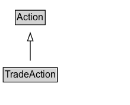

# TradeAction

The act of participating in an exchange of goods and services for monetary compensation. An agent trades an object, product or service with a participant in exchange for a one time or periodic payment.

## Diagram

=== "SVG (interactive)"

    <!-- Generated by graphviz version 14.1.3 (20260303.0454)
     -->
    <!-- Pages: 1 -->
    <svg width="164pt" height="132pt"
     viewBox="0.00 0.00 164.00 132.00" xmlns="http://www.w3.org/2000/svg" xmlns:xlink="http://www.w3.org/1999/xlink">
    <g id="graph0" class="graph" transform="scale(1 1) rotate(0) translate(4 128)">
    <polygon fill="white" stroke="none" points="-4,4 -4,-128 160.25,-128 160.25,4 -4,4"/>
    <g id="clust3" class="cluster">
    <title>cluster_associated</title>
    </g>
    <!-- Action -->
    <g id="node1" class="node">
    <title>Action</title>
    <g id="a_node1"><a xlink:href="../Action" xlink:title="&lt;TABLE&gt;">
    <polygon fill="lightgray" stroke="none" points="16.38,-97.88 16.38,-114.12 52.12,-114.12 52.12,-97.88 16.38,-97.88"/>
    <text xml:space="preserve" text-anchor="start" x="17.38" y="-101.88" font-family="Arial" font-size="12.00">Action</text>
    <polygon fill="none" stroke="black" points="15.38,-96.88 15.38,-115.12 53.12,-115.12 53.12,-96.88 15.38,-96.88"/>
    </a>
    </g>
    </g>
    <!-- TradeAction -->
    <g id="node2" class="node">
    <title>TradeAction</title>
    <g id="a_node2"><a xlink:href="../TradeAction" xlink:title="&lt;TABLE&gt;">
    <polygon fill="lightgray" stroke="none" points="1,-25.88 1,-42.12 67.5,-42.12 67.5,-25.88 1,-25.88"/>
    <text xml:space="preserve" text-anchor="start" x="2" y="-29.88" font-family="Arial" font-size="12.00">TradeAction</text>
    <polygon fill="none" stroke="black" points="0,-24.88 0,-43.12 68.5,-43.12 68.5,-24.88 0,-24.88"/>
    </a>
    </g>
    </g>
    <!-- TradeAction&#45;&gt;Action -->
    <g id="edge1" class="edge">
    <title>TradeAction&#45;&gt;Action</title>
    <path fill="none" stroke="black" d="M34.25,-51.79C34.25,-59.25 34.25,-68.24 34.25,-76.69"/>
    <polygon fill="none" stroke="black" points="30.75,-76.54 34.25,-86.54 37.75,-76.54 30.75,-76.54"/>
    </g>
    <!-- Invis -->
    </g>
    </svg>

=== "PNG"

    

## Specializations of TradeAction

| Class | Description |
|-------|-------------|
| [Buy Action](BuyAction.md) | The act of giving money to a seller in exchange for goods or services rendered. An agent buys an object, product, or service from a seller for a price. Reciprocal of SellAction. |
| [Order Action](OrderAction.md) | An agent orders an object/product/service to be delivered/sent. |
| [Pay Action](PayAction.md) | An agent pays a price to a participant. |
| [Pre Order Action](PreOrderAction.md) | An agent orders a (not yet released) object/product/service to be delivered/sent. |
| [Quote Action](QuoteAction.md) | An agent quotes/estimates/appraises an object/product/service with a price at a location/store. |
| [Rent Action](RentAction.md) | The act of giving money in return for temporary use, but not ownership, of an object such as a vehicle or property. For example, an agent rents a property from a landlord in exchange for a periodic payment. |
| [Sell Action](SellAction.md) | The act of taking money from a buyer in exchange for goods or services rendered. An agent sells an object, product, or service to a buyer for a price. Reciprocal of BuyAction. |
| [Tip Action](TipAction.md) | The act of giving money voluntarily to a beneficiary in recognition of services rendered. |

## Formalization for TradeAction

| Property | Constraint |
|----------|------------|
| subClassOf | [Action](Action.md) |

