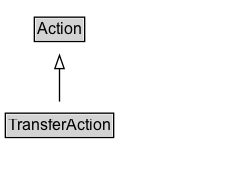

# TransferAction

The act of transferring/moving (abstract or concrete) animate or inanimate objects from one place to another.

## Diagram

=== "SVG (interactive)"

    <!-- Generated by graphviz version 14.1.3 (20260303.0454)
     -->
    <!-- Pages: 1 -->
    <svg width="178pt" height="132pt"
     viewBox="0.00 0.00 178.00 132.00" xmlns="http://www.w3.org/2000/svg" xmlns:xlink="http://www.w3.org/1999/xlink">
    <g id="graph0" class="graph" transform="scale(1 1) rotate(0) translate(4 128)">
    <polygon fill="white" stroke="none" points="-4,4 -4,-128 173.62,-128 173.62,4 -4,4"/>
    <g id="clust3" class="cluster">
    <title>cluster_associated</title>
    </g>
    <!-- Action -->
    <g id="node1" class="node">
    <title>Action</title>
    <g id="a_node1"><a xlink:href="../Action" xlink:title="&lt;TABLE&gt;">
    <polygon fill="lightgray" stroke="none" points="22.75,-97.88 22.75,-114.12 58.5,-114.12 58.5,-97.88 22.75,-97.88"/>
    <text xml:space="preserve" text-anchor="start" x="23.75" y="-101.88" font-family="Arial" font-size="12.00">Action</text>
    <polygon fill="none" stroke="black" points="21.75,-96.88 21.75,-115.12 59.5,-115.12 59.5,-96.88 21.75,-96.88"/>
    </a>
    </g>
    </g>
    <!-- TransferAction -->
    <g id="node2" class="node">
    <title>TransferAction</title>
    <g id="a_node2"><a xlink:href="../TransferAction" xlink:title="&lt;TABLE&gt;">
    <polygon fill="lightgray" stroke="none" points="1,-25.88 1,-42.12 80.25,-42.12 80.25,-25.88 1,-25.88"/>
    <text xml:space="preserve" text-anchor="start" x="2" y="-29.88" font-family="Arial" font-size="12.00">TransferAction</text>
    <polygon fill="none" stroke="black" points="0,-24.88 0,-43.12 81.25,-43.12 81.25,-24.88 0,-24.88"/>
    </a>
    </g>
    </g>
    <!-- TransferAction&#45;&gt;Action -->
    <g id="edge1" class="edge">
    <title>TransferAction&#45;&gt;Action</title>
    <path fill="none" stroke="black" d="M40.62,-51.79C40.62,-59.25 40.62,-68.24 40.62,-76.69"/>
    <polygon fill="none" stroke="black" points="37.13,-76.54 40.63,-86.54 44.13,-76.54 37.13,-76.54"/>
    </g>
    <!-- Invis -->
    </g>
    </svg>

=== "PNG"

    

## Specializations of TransferAction

| Class | Description |
|-------|-------------|
| [Borrow Action](BorrowAction.md) | The act of obtaining an object under an agreement to return it at a later date. Reciprocal of LendAction.\n\nRelated actions:\n\n* [[LendAction]]: Reciprocal of BorrowAction. |
| [Donate Action](DonateAction.md) | The act of providing goods, services, or money without compensation, often for philanthropic reasons. |
| [Download Action](DownloadAction.md) | The act of downloading an object. |
| [Give Action](GiveAction.md) | The act of transferring ownership of an object to a destination. Reciprocal of TakeAction.\n\nRelated actions:\n\n* [[TakeAction]]: Reciprocal of GiveAction.\n* [[SendAction]]: Unlike SendAction, GiveAction implies that ownership is being transferred (e.g. I may send my laptop to you, but that doesn't mean I'm giving it to you). |
| [Lend Action](LendAction.md) | The act of providing an object under an agreement that it will be returned at a later date. Reciprocal of BorrowAction.\n\nRelated actions:\n\n* [[BorrowAction]]: Reciprocal of LendAction. |
| [Money Transfer](MoneyTransfer.md) | The act of transferring money from one place to another place. This may occur electronically or physically. |
| [Receive Action](ReceiveAction.md) | The act of physically/electronically taking delivery of an object that has been transferred from an origin to a destination. Reciprocal of SendAction.\n\nRelated actions:\n\n* [[SendAction]]: The reciprocal of ReceiveAction.\n* [[TakeAction]]: Unlike TakeAction, ReceiveAction does not imply that the ownership has been transferred (e.g. I can receive a package, but it does not mean the package is now mine). |
| [Return Action](ReturnAction.md) | The act of returning to the origin that which was previously received (concrete objects) or taken (ownership). |
| [Send Action](SendAction.md) | The act of physically/electronically dispatching an object for transfer from an origin to a destination. Related actions:\n\n* [[ReceiveAction]]: The reciprocal of SendAction.\n* [[GiveAction]]: Unlike GiveAction, SendAction does not imply the transfer of ownership (e.g. I can send you my laptop, but I'm not necessarily giving it to you). |
| [Take Action](TakeAction.md) | The act of gaining ownership of an object from an origin. Reciprocal of GiveAction.\n\nRelated actions:\n\n* [[GiveAction]]: The reciprocal of TakeAction.\n* [[ReceiveAction]]: Unlike ReceiveAction, TakeAction implies that ownership has been transferred. |

## Formalization for TransferAction

| Property | Constraint |
|----------|------------|
| subClassOf | [Action](Action.md) |

