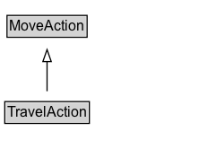

# TravelAction

The act of traveling from a fromLocation to a destination by a specified mode of transport, optionally with participants.

## Diagram

=== "SVG (interactive)"

    <!-- Generated by graphviz version 14.1.3 (20260303.0454)
     -->
    <!-- Pages: 1 -->
    <svg width="166pt" height="132pt"
     viewBox="0.00 0.00 166.00 132.00" xmlns="http://www.w3.org/2000/svg" xmlns:xlink="http://www.w3.org/1999/xlink">
    <g id="graph0" class="graph" transform="scale(1 1) rotate(0) translate(4 128)">
    <polygon fill="white" stroke="none" points="-4,4 -4,-128 162.38,-128 162.38,4 -4,4"/>
    <g id="clust3" class="cluster">
    <title>cluster_associated</title>
    </g>
    <!-- MoveAction -->
    <g id="node1" class="node">
    <title>MoveAction</title>
    <g id="a_node1"><a xlink:href="../MoveAction" xlink:title="&lt;TABLE&gt;">
    <polygon fill="lightgray" stroke="none" points="2.88,-97.88 2.88,-114.12 67.88,-114.12 67.88,-97.88 2.88,-97.88"/>
    <text xml:space="preserve" text-anchor="start" x="3.88" y="-101.88" font-family="Arial" font-size="12.00">MoveAction</text>
    <polygon fill="none" stroke="black" points="1.88,-96.88 1.88,-115.12 68.88,-115.12 68.88,-96.88 1.88,-96.88"/>
    </a>
    </g>
    </g>
    <!-- TravelAction -->
    <g id="node2" class="node">
    <title>TravelAction</title>
    <g id="a_node2"><a xlink:href="../TravelAction" xlink:title="&lt;TABLE&gt;">
    <polygon fill="lightgray" stroke="none" points="1,-25.88 1,-42.12 69.75,-42.12 69.75,-25.88 1,-25.88"/>
    <text xml:space="preserve" text-anchor="start" x="2" y="-29.88" font-family="Arial" font-size="12.00">TravelAction</text>
    <polygon fill="none" stroke="black" points="0,-24.88 0,-43.12 70.75,-43.12 70.75,-24.88 0,-24.88"/>
    </a>
    </g>
    </g>
    <!-- TravelAction&#45;&gt;MoveAction -->
    <g id="edge1" class="edge">
    <title>TravelAction&#45;&gt;MoveAction</title>
    <path fill="none" stroke="black" d="M35.38,-51.79C35.38,-59.25 35.38,-68.24 35.38,-76.69"/>
    <polygon fill="none" stroke="black" points="31.88,-76.54 35.38,-86.54 38.88,-76.54 31.88,-76.54"/>
    </g>
    <!-- Invis -->
    </g>
    </svg>

=== "PNG"

    

## Formalization for TravelAction

| Property | Constraint |
|----------|------------|
| subClassOf | [MoveAction](MoveAction.md) |

