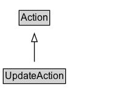

# UpdateAction

The act of managing by changing/editing the state of the object.

## Diagram

=== "SVG (interactive)"

    <!-- Generated by graphviz version 14.1.3 (20260303.0454)
     -->
    <!-- Pages: 1 -->
    <svg width="172pt" height="132pt"
     viewBox="0.00 0.00 172.00 132.00" xmlns="http://www.w3.org/2000/svg" xmlns:xlink="http://www.w3.org/1999/xlink">
    <g id="graph0" class="graph" transform="scale(1 1) rotate(0) translate(4 128)">
    <polygon fill="white" stroke="none" points="-4,4 -4,-128 168.38,-128 168.38,4 -4,4"/>
    <g id="clust3" class="cluster">
    <title>cluster_associated</title>
    </g>
    <!-- Action -->
    <g id="node1" class="node">
    <title>Action</title>
    <g id="a_node1"><a xlink:href="../Action" xlink:title="&lt;TABLE&gt;">
    <polygon fill="lightgray" stroke="none" points="20.5,-97.88 20.5,-114.12 56.25,-114.12 56.25,-97.88 20.5,-97.88"/>
    <text xml:space="preserve" text-anchor="start" x="21.5" y="-101.88" font-family="Arial" font-size="12.00">Action</text>
    <polygon fill="none" stroke="black" points="19.5,-96.88 19.5,-115.12 57.25,-115.12 57.25,-96.88 19.5,-96.88"/>
    </a>
    </g>
    </g>
    <!-- UpdateAction -->
    <g id="node2" class="node">
    <title>UpdateAction</title>
    <g id="a_node2"><a xlink:href="../UpdateAction" xlink:title="&lt;TABLE&gt;">
    <polygon fill="lightgray" stroke="none" points="1,-25.88 1,-42.12 75.75,-42.12 75.75,-25.88 1,-25.88"/>
    <text xml:space="preserve" text-anchor="start" x="2" y="-29.88" font-family="Arial" font-size="12.00">UpdateAction</text>
    <polygon fill="none" stroke="black" points="0,-24.88 0,-43.12 76.75,-43.12 76.75,-24.88 0,-24.88"/>
    </a>
    </g>
    </g>
    <!-- UpdateAction&#45;&gt;Action -->
    <g id="edge1" class="edge">
    <title>UpdateAction&#45;&gt;Action</title>
    <path fill="none" stroke="black" d="M38.38,-51.79C38.38,-59.25 38.38,-68.24 38.38,-76.69"/>
    <polygon fill="none" stroke="black" points="34.88,-76.54 38.38,-86.54 41.88,-76.54 34.88,-76.54"/>
    </g>
    <!-- Invis -->
    </g>
    </svg>

=== "PNG"

    

## Specializations of UpdateAction

| Class | Description |
|-------|-------------|
| [Add Action](AddAction.md) | The act of editing by adding an object to a collection. |
| [Append Action](AppendAction.md) | The act of inserting at the end if an ordered collection. |
| [Delete Action](DeleteAction.md) | The act of editing a recipient by removing one of its objects. |
| [Insert Action](InsertAction.md) | The act of adding at a specific location in an ordered collection. |
| [Prepend Action](PrependAction.md) | The act of inserting at the beginning if an ordered collection. |
| [Replace Action](ReplaceAction.md) | The act of editing a recipient by replacing an old object with a new object. |

## Formalization for UpdateAction

| Property | Constraint |
|----------|------------|
| subClassOf | [Action](Action.md) |

