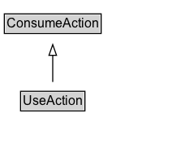

# UseAction

The act of applying an object to its intended purpose.

## Diagram

=== "SVG (interactive)"

    <!-- Generated by graphviz version 14.1.3 (20260303.0454)
     -->
    <!-- Pages: 1 -->
    <svg width="171pt" height="132pt"
     viewBox="0.00 0.00 171.00 132.00" xmlns="http://www.w3.org/2000/svg" xmlns:xlink="http://www.w3.org/1999/xlink">
    <g id="graph0" class="graph" transform="scale(1 1) rotate(0) translate(4 128)">
    <polygon fill="white" stroke="none" points="-4,4 -4,-128 166.75,-128 166.75,4 -4,4"/>
    <g id="clust3" class="cluster">
    <title>cluster_associated</title>
    </g>
    <!-- ConsumeAction -->
    <g id="node1" class="node">
    <title>ConsumeAction</title>
    <g id="a_node1"><a xlink:href="../ConsumeAction" xlink:title="&lt;TABLE&gt;">
    <polygon fill="lightgray" stroke="none" points="1,-97.88 1,-114.12 88.5,-114.12 88.5,-97.88 1,-97.88"/>
    <text xml:space="preserve" text-anchor="start" x="2" y="-101.88" font-family="Arial" font-size="12.00">ConsumeAction</text>
    <polygon fill="none" stroke="black" points="0,-96.88 0,-115.12 89.5,-115.12 89.5,-96.88 0,-96.88"/>
    </a>
    </g>
    </g>
    <!-- UseAction -->
    <g id="node2" class="node">
    <title>UseAction</title>
    <g id="a_node2"><a xlink:href="../UseAction" xlink:title="&lt;TABLE&gt;">
    <polygon fill="lightgray" stroke="none" points="16,-25.88 16,-42.12 73.5,-42.12 73.5,-25.88 16,-25.88"/>
    <text xml:space="preserve" text-anchor="start" x="17" y="-29.88" font-family="Arial" font-size="12.00">UseAction</text>
    <polygon fill="none" stroke="black" points="15,-24.88 15,-43.12 74.5,-43.12 74.5,-24.88 15,-24.88"/>
    </a>
    </g>
    </g>
    <!-- UseAction&#45;&gt;ConsumeAction -->
    <g id="edge1" class="edge">
    <title>UseAction&#45;&gt;ConsumeAction</title>
    <path fill="none" stroke="black" d="M44.75,-51.79C44.75,-59.25 44.75,-68.24 44.75,-76.69"/>
    <polygon fill="none" stroke="black" points="41.25,-76.54 44.75,-86.54 48.25,-76.54 41.25,-76.54"/>
    </g>
    <!-- Invis -->
    </g>
    </svg>

=== "PNG"

    

## Specializations of UseAction

| Class | Description |
|-------|-------------|
| [Wear Action](WearAction.md) | The act of dressing oneself in clothing. |

## Formalization for UseAction

| Property | Constraint |
|----------|------------|
| subClassOf | [ConsumeAction](ConsumeAction.md) |

